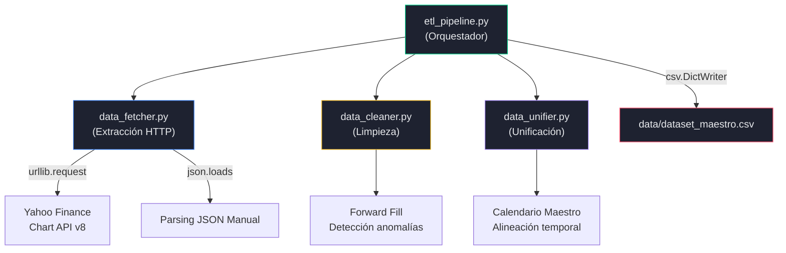
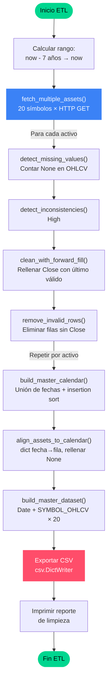

# Requerimiento 1 — Pipeline ETL: Extracción, Transformación y Carga de Datos Financieros

---

## 1. Objetivo del Requerimiento

Diseñar e implementar un pipeline ETL (Extract, Transform, Load) completamente funcional que descargue datos financieros históricos OHLCV (Open, High, Low, Close, Volume) de un mínimo de 20 activos bursátiles con al menos 5 años de historia, los limpie, unifique y exporte a un dataset maestro consolidado en formato CSV. Todo ello sin utilizar librerías de alto nivel como `yfinance`, `pandas`, `pandas_datareader` ni `numpy`.

## 2. Problema que Resuelve

Los datos financieros en bruto presentan múltiples desafíos técnicos:

- **Heterogeneidad de calendarios bursátiles**: Cada activo cotiza en mercados con festivos y horarios distintos. Un ETF como VOO (NYSE) tiene un calendario diferente a EWZ (mercado brasileño).
- **Datos faltantes**: La API puede devolver `null` en campos OHLCV para ciertos días.
- **Inconsistencias lógicas**: Valores donde `High < Low` o `Close` fuera del rango `[Low, High]`, causados por ajustes o errores del proveedor.
- **Necesidad de alineación temporal**: Para análisis comparativos (similitud, correlación) todas las series deben compartir el mismo eje temporal.
- **Restricción académica**: La prohibición de librerías de alto nivel obliga a implementar manualmente toda la lógica de descarga HTTP, parsing JSON, limpieza de datos y exportación CSV.

## 3. Arquitectura Involucrada

### 3.1 Módulos del Pipeline

El pipeline ETL se compone de 4 módulos en el paquete `etl/`:

| Módulo | Archivo | Responsabilidad |
|--------|---------|-----------------|
| **Extracción** | `data_fetcher.py` | Descarga HTTP directa a Yahoo Finance Chart API v8 |
| **Limpieza** | `data_cleaner.py` | Detección de faltantes, inconsistencias y forward fill |
| **Unificación** | `data_unifier.py` | Calendario maestro, alineación temporal, dataset consolidado |
| **Orquestador** | `etl_pipeline.py` | Coordina los 3 módulos anteriores y exporta CSV |

### 3.2 Diagrama de Arquitectura



## 4. Flujo Completo del Sistema

```mermaid
flowchart LR
    subgraph Extracción
        E1["Calcular rango<br/>de fechas (7 años)"] --> E2["Construir URL<br/>por activo"]
        E2 --> E3["HTTP GET con<br/>urllib.request"]
        E3 --> E4["Parsear JSON<br/>con json.loads"]
        E4 --> E5["Construir lista<br/>de dict OHLCV"]
    end

    subgraph Transformación
        T1["Detectar valores<br/>faltantes (None)"] --> T2["Detectar<br/>inconsistencias OHLC"]
        T2 --> T3["Forward fill<br/>en Close"]
        T3 --> T4["Eliminar filas<br/>sin Close válido"]
    end

    subgraph Carga
        L1["Construir calendario<br/>maestro (set → sort)"] --> L2["Alinear cada activo<br/>al calendario"]
        L2 --> L3["Construir dataset<br/>maestro (Date + OHLCV × k)"]
        L3 --> L4["Exportar CSV<br/>con csv.DictWriter"]
    end

    E5 --> T1
    T4 --> L1
```



**Pasos detallados:**

1. **Cálculo del rango temporal**: Se calcula la fecha actual menos 7 años (7 × 365 = 2555 días) usando `datetime`.
2. **Descarga por activo**: Para cada uno de los 20 símbolos, se construye la URL del Chart API v8, se realiza un GET HTTP con `urllib.request`, se parsea el JSON y se extrae la estructura OHLCV.
3. **Pausa entre peticiones**: Delay de 0.3 segundos (`time.sleep`) para evitar rate limiting del servidor.
4. **Reintentos**: Hasta 3 intentos por activo en caso de timeout, con 2 segundos de espera entre reintentos.
5. **Limpieza por activo**: Detección de valores `None`, detección de inconsistencias lógicas en OHLC, forward fill en Close, eliminación de filas inválidas.
6. **Unificación**: Construcción del calendario maestro con todas las fechas únicas, alineación de cada activo al calendario, construcción del dataset maestro.
7. **Exportación**: Escritura del dataset a `data/dataset_maestro.csv` con `csv.DictWriter`.

## 5. Explicación Detallada del Código

### 5.1 `etl/__init__.py`

Expone la función `run_etl` como interfaz pública del paquete. Permite que `main.py` importe simplemente `from etl import run_etl`.

### 5.2 `etl/data_fetcher.py` — Extracción HTTP

**Propósito**: Descargar datos OHLCV directamente de la API de Yahoo Finance sin usar `yfinance`.

**Funciones clave:**

| Función | Responsabilidad | Complejidad |
|---------|----------------|-------------|
| `_date_to_unix(date_str)` | Convierte `"YYYY-MM-DD"` a timestamp Unix | O(1) |
| `_unix_to_date(timestamp)` | Convierte timestamp Unix a `"YYYY-MM-DD"` | O(1) |
| `_build_chart_url(symbol, p1, p2)` | Construye URL del Chart API v8 | O(1) |
| `_do_http_get(url, timeout)` | Petición HTTP GET con `urllib.request` | O(1) red |
| `_do_http_get_with_retry(url, ...)` | GET con reintentos en timeout | O(1) × intentos |
| `_parse_chart_json(raw_bytes)` | Parsea respuesta JSON a lista de dict | O(n) |
| `fetch_asset_data(symbol, start, end)` | Descarga completa de un activo | O(n) |
| `fetch_multiple_assets(symbols, ...)` | Descarga múltiples activos | O(k × n) |

#### Análisis línea por línea de `_parse_chart_json`

```python
def _parse_chart_json(raw_bytes):
```

**Entrada**: `raw_bytes` — bytes crudos de la respuesta HTTP.

**Salida**: `list[dict]` — cada dict tiene keys `Date, Open, High, Low, Close, Volume`.

**Lógica paso a paso:**

1. `json.loads(raw_bytes.decode("utf-8"))` — Decodifica bytes a string UTF-8 y parsea JSON. **Decisión de diseño**: Se usa `json` de la biblioteca estándar en lugar de `requests.json()` para minimizar dependencias.

2. Navegación explícita del JSON: `data["chart"]["result"][0]` — La estructura de Yahoo es `chart → result[0] → timestamp[] + indicators.quote[0].{open,high,low,close,volume}[]`. Se navega manualmente con `.get()` para capturar errores sin excepciones no controladas.

3. `pad_to(lst, length, fill=None)` — Función interna que rellena listas cortas con `None` hasta alcanzar la longitud de `timestamps`. **Justificación**: A veces el API devuelve listas de OHLCV más cortas que `timestamps` (datos parciales al final del día).

4. Construcción de la lista de diccionarios con un bucle `for i in range(n)`. **Estructura de datos elegida**: `list[dict]` permite acceso O(1) por clave y preserva el orden temporal.

#### Análisis de `_do_http_get_with_retry`

```python
def _do_http_get_with_retry(url, timeout_seconds=90, max_attempts=3, retry_delay=2):
```

Implementa el patrón **retry con backoff constante**. Solo reintenta en errores de timeout (detectados por substring `"timed out"` o `"timeout"` en el mensaje de excepción). Otros errores (404, 403) se propagan inmediatamente. **Justificación**: Los timeouts son transitorios (congestión de red), mientras que un 404 indica un símbolo inválido que no se resolverá con reintentos.

### 5.3 `etl/data_cleaner.py` — Limpieza de Datos

**Propósito**: Detectar y corregir problemas de calidad en los datos descargados.

#### `detect_missing_values(asset_data)`

**Entrada**: Lista de diccionarios con campos OHLCV.

**Salida**: Tupla `(total_count, positions)` donde `total_count` es el número de celdas con `None` y `positions` es la lista de índices de fila afectados.

**Algoritmo**: Una sola pasada O(n) sobre las filas. Por cada fila, inspecciona 5 campos (constante). Usa un `set` auxiliar `seen_positions` para evitar duplicados en `positions` manteniendo O(1) en inserción y búsqueda.

**Complejidad temporal**: O(n) — una pasada, 5 accesos a dict por fila (O(1) cada uno).

**Complejidad espacial**: O(n) en el peor caso (todas las filas tienen faltantes).

#### `detect_inconsistencies(asset_data)`

**Entrada**: Lista de diccionarios OHLCV.

**Salida**: Lista de anomalías detectadas, cada una como dict con `index`, `type`, `row`.

**Reglas de detección:**
1. `High < Low` — Imposible en una vela válida.
2. `Close ∉ [Low, High]` — Precio de cierre fuera del rango intradía.
3. `Open ∉ [Low, High]` — Precio de apertura fuera del rango.

**Complejidad**: O(n) — una pasada con comparaciones constantes por fila.

#### `clean_with_forward_fill(asset_data)`

**Entrada**: Lista de diccionarios (modificación in-place del campo `Close`).

**Algoritmo formal**:

```
last_valid ← None
para i = 0 hasta n-1:
    si asset_data[i]["Close"] ≠ None:
        last_valid ← asset_data[i]["Close"]
    si no, si last_valid ≠ None:
        asset_data[i]["Close"] ← last_valid
```

**Justificación del forward fill**: En series temporales financieras, asumir que el precio se mantiene hasta la siguiente observación es la heurística estándar. Introduce correlación artificial mínima si los faltantes son aislados. **No se usa interpolación lineal** para no inventar precios intermedios y mantener interpretación económica clara.

**Complejidad temporal**: O(n) — una sola pasada.

**Complejidad espacial**: O(1) — solo la variable `last_valid`.

#### `remove_invalid_rows(asset_data)`

**Entrada**: Lista de diccionarios.

**Salida**: Nueva lista conteniendo solo filas con `Close ≠ None`.

**Decisión de diseño**: Se construye una nueva lista con `.append()` en lugar de usar `.remove()` in-place. **Justificación**: `.remove()` sobre una lista tiene complejidad O(n) por llamada (desplazamiento de elementos), lo que daría O(n²) total. Con `.append()` se mantiene O(n).

### 5.4 `etl/data_unifier.py` — Unificación Temporal

#### `build_master_calendar(all_assets_data)`

**Entrada**: Dict `{symbol: [row, ...]}` con los datos limpios de todos los activos.

**Salida**: Lista de fechas únicas ordenadas cronológicamente.

**Algoritmo:**

1. Reunir todas las fechas en un `set` → O(N) donde N = total de filas en todos los activos.
2. Convertir a lista y ordenar con **insertion sort manual** → O(U²) donde U = fechas únicas.

**Justificación del insertion sort manual**: La restricción del proyecto prohíbe `sorted()`. Para ~1800 fechas únicas (7 años × ~252 días hábiles), O(U²) ≈ 3.24 millones de comparaciones, ejecutable en < 1 segundo en Python.

**Justificación del `set`**: Reunir fechas únicas en O(1) amortizado por inserción, evitando duplicados sin búsqueda lineal.

**Justificación del orden lexicográfico**: Las fechas en formato `YYYY-MM-DD` se ordenan lexicográficamente igual que cronológicamente, eliminando la necesidad de parsing de fechas para comparación.

#### `align_assets_to_calendar(all_assets_data, master_calendar)`

**Entrada**: Datos por activo + calendario maestro.

**Salida**: Dict `{symbol: [row, ...]}` donde cada lista tiene exactamente `len(master_calendar)` elementos.

**Algoritmo:**

```
para cada symbol:
    date_to_row ← dict()  # O(1) lookup por fecha
    para cada row en datos del activo:
        date_to_row[row["Date"]] ← row
    aligned_list ← []
    para cada date en master_calendar:
        si date en date_to_row:
            aligned_list.append(date_to_row[date])
        si no:
            aligned_list.append({Date: date, OHLCV: None})
```

**Complejidad temporal**: O(k × n) donde k = activos, n = fechas del calendario.

**Justificación del dict intermedio**: Sin él, buscar una fecha en la lista del activo costaría O(n_asset) por fecha, dando O(n × n_asset) por activo. Con dict se reduce a O(n + n_asset).

#### `build_master_dataset(aligned_data)`

**Entrada**: Datos alineados (todas las listas de igual longitud).

**Salida**: Lista de diccionarios con columnas `Date, SYMBOL_Open, SYMBOL_High, SYMBOL_Low, SYMBOL_Close, SYMBOL_Volume` para cada símbolo.

**Complejidad**: O(k × n × 5) = O(k × n) donde k = 20 activos, n ≈ 1800 fechas.

### 5.5 `etl/etl_pipeline.py` — Orquestador

**Propósito**: Coordinar la ejecución secuencial de extracción → limpieza → unificación → exportación.

**Función principal `run_etl()`**:

1. Calcula rango de fechas: `now - 7 años` hasta `now`.
2. Llama a `fetch_multiple_assets()` con `min_success=20`.
3. Para cada activo: `detect_missing_values` → `detect_inconsistencies` → `clean_with_forward_fill` → `remove_invalid_rows`.
4. `build_master_calendar` → `align_assets_to_calendar` → `build_master_dataset`.
5. Exporta con `csv.DictWriter` a `data/dataset_maestro.csv`.
6. Imprime reporte detallado de limpieza.

**Función auxiliar `_isort(lst)`**: Insertion sort manual sobre listas de strings, utilizada para ordenar claves de diccionarios sin `sorted()`.

## 6. Fundamento Matemático

### 6.1 Conversión de Fechas a Unix Timestamp

$$t_{unix} = \lfloor (d - d_{epoch}) \cdot 86400 \rfloor$$

donde $d_{epoch}$ = 1970-01-01 y 86400 = segundos/día.

### 6.2 Forward Fill

Definición formal: Dada una serie $\{x_0, x_1, \ldots, x_{n-1}\}$ con valores faltantes (marcados como $\bot$):

$$x_i^{*} = \begin{cases} x_i & \text{si } x_i \neq \bot \\ x_{j}^{*} & \text{donde } j = \max\{k < i : x_k \neq \bot\} \\ \bot & \text{si no existe tal } j \end{cases}$$

### 6.3 Calendario Maestro como Unión de Conjuntos

$$\mathcal{C} = \text{sort}\left(\bigcup_{s \in S} \{d : d \in \text{dates}(s)\}\right)$$

donde $S$ es el conjunto de activos y $\text{dates}(s)$ son las fechas disponibles para el activo $s$.

## 7. Complejidad Algorítmica

| Operación | Temporal | Espacial | Peor Caso | Caso Promedio |
|-----------|----------|----------|-----------|---------------|
| Descarga por activo | O(n) | O(n) | Timeout (90s) | ~2s por activo |
| Descarga total (k activos) | O(k × n) | O(k × n) | k × timeout | ~40s para 20 activos |
| Detección de faltantes | O(n) | O(n) | Todos faltantes | Pocos faltantes |
| Detección de inconsistencias | O(n) | O(a) | a = n anomalías | a ≈ 0 |
| Forward fill | O(n) | O(1) | Todos faltantes | Pocos faltantes |
| Eliminación de inválidos | O(n) | O(n) | Ninguno eliminado | Pocos eliminados |
| Calendario maestro (sort) | O(U²) | O(U) | U ≈ 1800 | Insertion sort manual |
| Alineación | O(k × U) | O(k × U) | k = 20, U ≈ 1800 | ~36,000 operaciones |
| Dataset maestro | O(k × U) | O(k × U × 5) | 20 × 1800 × 5 | ~180,000 entradas |

**Posible optimización del calendario**: Reemplazar insertion sort O(U²) por merge sort manual O(U log U). Para U ≈ 1800, la mejora sería de ~3.24M comparaciones a ~19,000. Sin embargo, con U = 1800, el tiempo real del insertion sort es < 1 segundo, haciendo la optimización innecesaria en la práctica.

## 8. Estructuras de Datos Utilizadas

| Estructura | Uso | Justificación |
|------------|-----|---------------|
| `list[dict]` | Almacenar filas OHLCV por activo | Acceso O(1) por índice, O(1) por clave |
| `dict{symbol: list}` | Organizar datos por activo | Acceso O(1) por símbolo |
| `set` | Reunir fechas únicas en calendario | Inserción O(1), no duplicados |
| `dict{date: row}` | Lookup rápido fecha→fila en alineación | Búsqueda O(1) vs O(n) con lista |
| `list` (ordenada) | Calendario maestro | Orden cronológico preservado |

## 9. Restricciones del Proyecto Cumplidas

| Restricción | Cumplimiento | Evidencia en código |
|-------------|-------------|---------------------|
| NO `yfinance` | ✅ | Usa `urllib.request` + `json.loads` en `data_fetcher.py` |
| NO `pandas_datareader` | ✅ | No importado en ningún módulo |
| NO `pandas` | ✅ | Usa `csv.DictReader/DictWriter` para I/O |
| NO `numpy` | ✅ | Solo `math` estándar |
| NO `sorted()` | ✅ | Insertion sort manual en `_isort()`, `build_master_calendar()` |
| Datos descargados en ejecución | ✅ | `run_etl()` descarga datos frescos de Yahoo |
| Mínimo 20 activos | ✅ | 20 símbolos en `ASSET_SYMBOLS` + validación `min_success=20` |
| Mínimo 5 años de historia | ✅ | `START_YEARS_BACK = 7` (excede el requisito) |
| Manejo manual de errores HTTP | ✅ | `_do_http_get` captura `HTTPError`, `URLError`, `OSError` |
| Parsing manual de JSON | ✅ | Navegación explícita de la estructura en `_parse_chart_json` |

## 10. Justificación de Decisiones Técnicas

### 10.1 Yahoo Finance Chart API v8 vs alternativas

**Elegida**: Yahoo Chart API v8 (endpoint público, JSON).

**Ventajas**: Gratuita, sin registro, soporta OHLCV diario, cobertura global.

**Desventajas**: Sin documentación oficial, puede cambiar sin aviso, rate limiting no documentado.

**Alternativas descartadas**:
- Alpha Vantage: Requiere API key, límite de 5 llamadas/minuto.
- IEX Cloud: Requiere pago para datos históricos > 5 años.
- Quandl: Discontinuado en 2023.

### 10.2 `urllib.request` vs `requests`

**Elegida**: `urllib.request` (biblioteca estándar).

**Ventajas**: Cero dependencias externas, cumple restricción académica.

**Desventajas**: API menos ergonómica que `requests`.

### 10.3 Forward fill vs interpolación lineal

**Elegida**: Forward fill (último valor conocido).

**Justificación financiera**: El forward fill asume que el precio se mantiene hasta la próxima observación, lo cual refleja la realidad del mercado (el último precio de cierre es el mejor estimador del valor actual). La interpolación lineal inventaría precios intermedios que nunca existieron, distorsionando análisis de volatilidad y retornos.

### 10.4 `list[dict]` vs clases/tuplas

**Elegida**: `list[dict]` para todas las estructuras de datos.

**Ventajas**: Acceso O(1) por clave, compatible con `csv.DictWriter`, flexible ante cambios de esquema, no requiere definir clases.

**Desventajas**: Mayor uso de memoria que tuplas nombradas, sin type checking.

## 11. Diagrama de Flujo ETL Completo



## 12. Ejemplos Reales del Sistema

### 12.1 Activos del Portafolio

El portafolio incluye 20 activos configurados en `config.py`:

| Categoría | Símbolos |
|-----------|----------|
| ETFs US grandes | VOO, SPY, IVV, QQQ, VTI |
| ETFs US complementarios | DIA, IWM, EFA, EEM, IWD |
| ETFs internacionales | VEA, VWO, VGK, EWZ, EWG |
| Colombia/LATAM (ADRs) | EC (Ecopetrol), AVAL (Grupo Aval), CIB (Bancolombia), PBR (Petrobras), BBD (Banco Bradesco) |

### 12.2 Estructura del CSV de Salida

El archivo `data/dataset_maestro.csv` tiene la estructura:

```
Date,AVAL_Open,AVAL_High,AVAL_Low,AVAL_Close,AVAL_Volume,BBD_Open,...,VOO_Close,VOO_Volume
2019-05-14,7.5,7.6,7.4,7.55,150000,8.2,...,264.31,3500000
2019-05-15,7.55,7.7,7.5,7.65,180000,8.15,...,262.18,4200000
```

Cada fila representa una fecha del calendario maestro. Columnas: `Date` + 5 campos OHLCV × 20 activos = **101 columnas**. Filas: ~1800 (7 años × ~252 días hábiles).

### 12.3 Ejemplo de URL Construida

Para el activo VOO, período 2019-05-14 a 2026-05-14:

```
https://query1.finance.yahoo.com/v8/finance/chart/VOO?period1=1557792000&period2=1747180800&interval=1d&events=div%2Csplits
```

## 13. Posibles Mejoras

### 13.1 Optimizaciones

- **Caché local**: Almacenar respuestas HTTP en disco para evitar redescargas en ejecuciones repetidas. El campo `CACHE_DIR` ya está definido en `config.py` pero no implementado.
- **Descarga paralela**: Usar `concurrent.futures.ThreadPoolExecutor` para descargar múltiples activos simultáneamente, reduciendo el tiempo total de ~60s a ~10s.
- **Merge sort para calendario**: Reemplazar insertion sort O(U²) por merge sort O(U log U).

### 13.2 Escalabilidad

- **Más activos**: El diseño soporta fácilmente 50+ activos; el cuello de botella es la descarga HTTP, no el procesamiento.
- **Mayor granularidad**: Soportar datos intradía (intervalos de 1h, 15min) modificando `_INTERVAL`.
- **Bases de datos**: Reemplazar CSV por SQLite para consultas más eficientes en portafolios grandes.

### 13.3 Mejoras de Arquitectura

- **Separación de configuración**: El `etl_pipeline.py` duplica `ASSET_SYMBOLS` que ya existe en `config.py`. Debería importarlo de `config.py`.
- **Logging estructurado**: Reemplazar `print()` por `logging` para control de niveles y rotación de logs.
- **Validación de esquema**: Implementar validación formal del schema del JSON antes de extraer campos.

### 13.4 Malas Prácticas Detectadas

1. **Duplicación de constantes**: `ASSET_SYMBOLS` está definida tanto en `config.py` como en `etl_pipeline.py`. Esto viola el principio DRY y puede causar inconsistencias.
2. **Módulo `config.py` parcialmente utilizado**: Varias constantes como `CACHE_DIR`, `FETCH_DELAY_SECONDS`, `FETCH_TIMEOUT_SECONDS` están definidas pero no se importan en los módulos que las necesitan.
3. **Sin tests automatizados integrados**: Los tests están en bloques `if __name__ == "__main__"` dentro de cada módulo, sin un framework de testing (pytest). Esto dificulta la ejecución automatizada y el reporte de cobertura.
