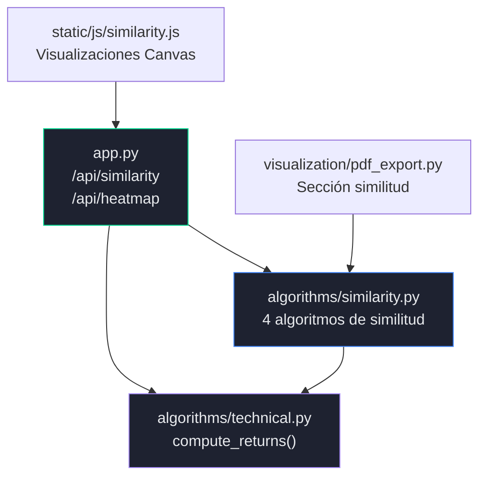
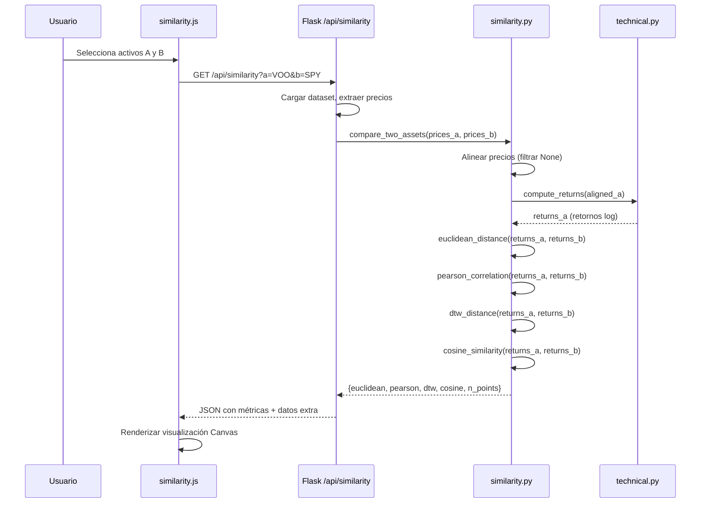
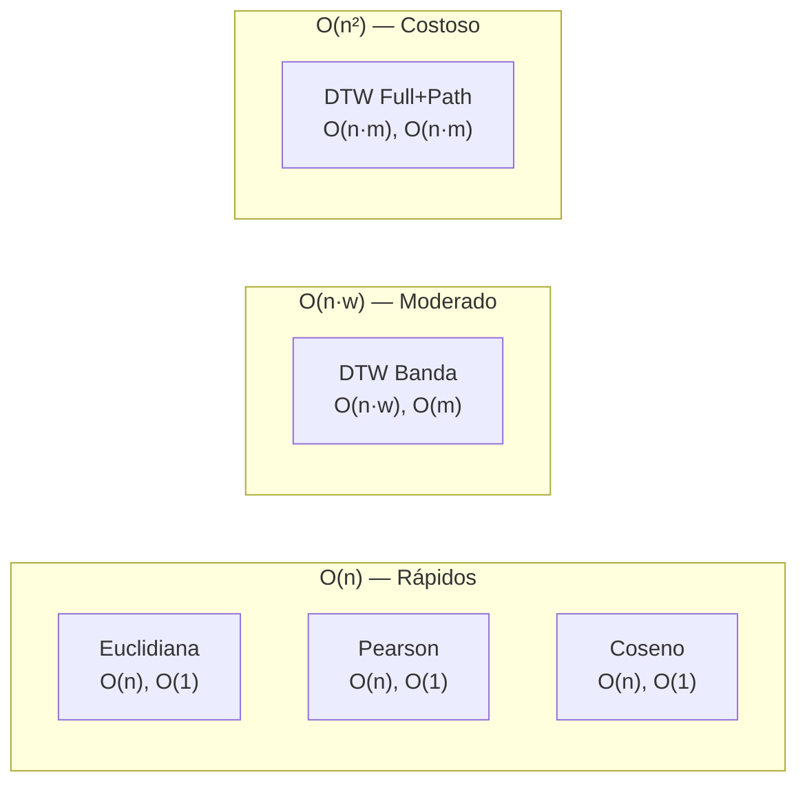
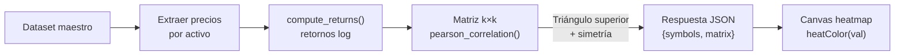

# Requerimiento 2 — Algoritmos de Similitud entre Series de Tiempo Financieras

---

## 1. Objetivo del Requerimiento

Implementar manualmente al menos 4 algoritmos de medición de similitud entre series de tiempo financieras, aplicables al portafolio de 20 activos. Cada algoritmo debe incluir formulación matemática formal, pseudocódigo explícito, análisis de complejidad y justificación de uso. Todo sin utilizar `scipy`, `numpy`, `sklearn` ni ninguna función encapsulada de similitud.

## 2. Problema que Resuelve

En análisis financiero, determinar qué activos se comportan de manera similar permite:

- **Diversificación de portafolios**: Activos con baja similitud reducen riesgo conjunto.
- **Detección de pares para trading**: Activos altamente correlacionados permiten estrategias de pairs trading.
- **Análisis de contagio**: Identificar cómo se propagan los movimientos entre activos.
- **Construcción de heatmaps**: Visualizar las relaciones entre todos los pares del portafolio.

Cada métrica captura un aspecto distinto de la similitud, por lo que implementar 4 algoritmos complementarios ofrece una visión multidimensional.

## 3. Arquitectura Involucrada



**Archivos involucrados:**

| Archivo | Responsabilidad |
|---------|----------------|
| `algorithms/similarity.py` | 4 implementaciones manuales + `compare_two_assets` + DTW con path |
| `algorithms/technical.py` | `compute_returns()` — retornos logarítmicos para normalización |
| `app.py` | Endpoints `/api/similarity` y `/api/heatmap` |
| `static/js/similarity.js` | Visualizaciones interactivas per-algoritmo |

## 3.1 Cumplimiento del Requisito Funcional de UI

El PDF del proyecto establece textualmente: *"La aplicación deberá permitir al usuario seleccionar dos activos, visualizar sus series temporales y mostrar los valores de similitud calculados por cada algoritmo."*

**Implementación en el sistema:**

| Requisito del PDF | Implementación | Ubicación |
|-------------------|---------------|-----------|
| Seleccionar dos activos | Dos selectores HTML (`<select>`) con los 20 activos del portafolio | `similarity.html` — `#sim-sym-a`, `#sim-sym-b` |
| Visualizar series temporales | Gráfico Canvas con ambas series normalizadas superpuestas | `similarity.js` — `drawOverviewChart()` |
| Mostrar valores de similitud | 4 metric cards con valores numéricos (Euclidiana, Pearson, DTW, Coseno) | `similarity.html` — `#metric-cards` |
| Por cada algoritmo | Click en cada metric card activa visualización y explicación específica | `similarity.js` — `selectAlgorithm()` |

El flujo completo permite al usuario seleccionar cualquier par de activos, comparar sus series de forma interactiva, y explorar cada algoritmo con su propia visualización (diferencias punto a punto, scatter plot, alineación DTW, diagrama vectorial) y panel de explicación matemática.

## 4. Flujo Completo del Sistema



## 5. Explicación Detallada del Código

### 5.1 Preprocesamiento: `compare_two_assets(prices_a, prices_b)`

Antes de aplicar cualquier algoritmo, esta función:

1. **Alinea las series**: Recorre ambas listas simultáneamente, incluyendo solo posiciones donde ambos precios son válidos (`not None`, `> 0`).
2. **Calcula retornos logarítmicos**: Llama a `compute_returns()` para normalizar las series. **Justificación**: Los precios crudos tienen escalas muy diferentes (VOO ≈ $500, EC ≈ $10). Los retornos logarítmicos $r_i = \ln(P_i / P_{i-1})$ son adimensionales y comparables entre activos.
3. **Ejecuta los 4 algoritmos** sobre los retornos.

### 5.2 Retornos Logarítmicos: `compute_returns(prices)`

```python
def compute_returns(prices):
    returns = []
    for i in range(1, n):
        if prices[i-1] > 0 and prices[i] > 0:
            returns.append(math.log(prices[i] / prices[i-1]))
        else:
            returns.append(0.0)
    return returns
```

**Propiedades de los retornos logarítmicos**:
- **Aditividad temporal**: $r_{total} = \sum r_i$ (vs retornos simples que requieren multiplicación).
- **Simetría**: Una ganancia del x% y pérdida del x% producen retornos de magnitud similar.
- **Aproximación**: Para variaciones pequeñas, $\ln(1 + r) \approx r$.

## 6. Explicación Línea por Línea de Algoritmos Importantes

### 6.1 Distancia Euclidiana — `euclidean_distance(series_a, series_b)`

```python
def euclidean_distance(series_a, series_b):
    n = len(series_a)                           # 1. Obtener longitud
    if n != len(series_b):                      # 2. Validar igualdad de longitudes
        raise ValueError(...)
    if n == 0:                                  # 3. Caso base: series vacías
        return 0.0
    sum_sq = 0.0                                # 4. Inicializar acumulador
    for i in range(n):                          # 5. Recorrer ambas series
        diff = series_a[i] - series_b[i]        # 6. Diferencia punto a punto
        sum_sq += diff * diff                   # 7. Acumular cuadrado
    return math.sqrt(sum_sq)                    # 8. Raíz cuadrada
```

**Entrada**: Dos listas de floats de igual longitud (retornos logarítmicos).

**Salida**: Float ≥ 0. Menor valor = series más similares.

**Estructura**: `list[float]` — acceso O(1) por índice, sin estructuras auxiliares.

**Decisión de diseño**: Se acumula `diff * diff` en lugar de `diff ** 2` para evitar la llamada a `pow()` y mejorar rendimiento.

### 6.2 Correlación de Pearson — `pearson_correlation(series_a, series_b)`

```python
def pearson_correlation(series_a, series_b):
    n = len(series_a)
    # Pasada 1: medias
    sum_a, sum_b = 0.0, 0.0
    for i in range(n):
        sum_a += series_a[i]
        sum_b += series_b[i]
    mean_a = sum_a / n
    mean_b = sum_b / n

    # Pasada 2: sumas cruzadas
    sum_xy, sum_x2, sum_y2 = 0.0, 0.0, 0.0
    for i in range(n):
        dx = series_a[i] - mean_a
        dy = series_b[i] - mean_b
        sum_xy += dx * dy
        sum_x2 += dx * dx
        sum_y2 += dy * dy

    denominator = math.sqrt(sum_x2 * sum_y2)
    if denominator == 0.0:
        return 0.0  # varianza nula
    return sum_xy / denominator
```

**Justificación de dos pasadas**: La fórmula de una sola pasada $\sum x_i y_i - n \bar{x} \bar{y}$ sufre de cancelación catastrófica cuando los valores son grandes con varianza pequeña. Dos pasadas evitan este problema a costa de un factor constante ×2 en tiempo, que no afecta la complejidad asintótica O(n).

### 6.3 Dynamic Time Warping (DTW) — `dtw_distance(series_a, series_b, window=None)`

Este es el algoritmo más complejo del módulo. Implementa programación dinámica con la optimización de banda de Sakoe-Chiba y optimización de espacio a 2 filas.

**Algoritmo paso a paso:**

1. **Determinar ancho de banda `w`**: Si no se especifica, usa `max(n, m) // 4` con mínimo 10. Asegura que `w ≥ |n - m|` para poder alcanzar la esquina `(n-1, m-1)`.

2. **Inicializar 2 filas** de tamaño `m` con `INF` (infinito).

3. **Llenar fila 0**: Para cada `j` dentro de la banda (`|0 - j| ≤ w`), calcula `cost = |a[0] - b[j]|` y acumula: `prev_row[j] = cost + prev_row[j-1]`.

4. **Llenar filas 1 a n-1**: Para cada `(i, j)` dentro de la banda:
   ```
   cost = |a[i] - b[j]|
   candidates = min(prev_row[j],         # arriba
                     curr_row[j-1],       # izquierda
                     prev_row[j-1])       # diagonal
   curr_row[j] = cost + candidates
   ```
   Al final de cada fila, intercambiar `prev_row` y `curr_row`.

5. **Resultado**: `prev_row[m-1]` (última celda tras el intercambio final).

**Optimización de espacio**: Se usan solo 2 filas en lugar de la matriz completa n×m. Para n = m = 1800, esto reduce el uso de memoria de ~25 MB (1800² × 8 bytes) a ~29 KB (2 × 1800 × 8 bytes).

**DTW con path** (`dtw_distance_with_path`): Variante que construye la **matriz completa** para poder hacer backtracking y recuperar el warping path. Usada solo para la visualización en el dashboard, no para el cálculo de la métrica. Complejidad espacial O(n × m).

### 6.4 Similitud por Coseno — `cosine_similarity(series_a, series_b)`

```python
def cosine_similarity(series_a, series_b):
    dot, norm_a_sq, norm_b_sq = 0.0, 0.0, 0.0
    for i in range(n):
        dot += series_a[i] * series_b[i]       # producto punto
        norm_a_sq += series_a[i] * series_a[i]  # norma² de A
        norm_b_sq += series_b[i] * series_b[i]  # norma² de B
    norm_a = math.sqrt(norm_a_sq)
    norm_b = math.sqrt(norm_b_sq)
    if norm_a == 0.0 or norm_b == 0.0:
        return 0.0
    return dot / (norm_a * norm_b)
```

**Decisión de diseño**: Se calcula todo en una sola pasada (producto punto y ambas normas simultáneamente), evitando recorrer las listas 3 veces.

## 7. Fundamento Matemático

### 7.1 Distancia Euclidiana

$$d(\mathbf{x}, \mathbf{y}) = \sqrt{\sum_{i=1}^{n} (x_i - y_i)^2} = \|\mathbf{x} - \mathbf{y}\|_2$$

Corresponde a la norma L2 del vector diferencia. Es una métrica en el sentido estricto (satisface no-negatividad, identidad de indiscernibles, simetría y desigualdad triangular).

**Limitación**: Sensible a la magnitud absoluta. Dos series con la misma forma pero diferente escala tendrán distancia grande. Se mitiga al usar retornos logarítmicos.

### 7.2 Correlación de Pearson

$$r = \frac{\sum_{i=1}^{n} (x_i - \bar{x})(y_i - \bar{y})}{\sqrt{\sum_{i=1}^{n}(x_i - \bar{x})^2} \cdot \sqrt{\sum_{i=1}^{n}(y_i - \bar{y})^2}} = \frac{\text{Cov}(X, Y)}{\sigma_X \cdot \sigma_Y}$$

- $r \in [-1, 1]$
- $r = +1$: correlación positiva perfecta (se mueven juntos)
- $r = -1$: correlación negativa perfecta (se mueven opuesto)
- $r = 0$: sin correlación lineal

**Propiedad clave**: Invariante a transformaciones lineales $Y' = aY + b$. Ideal para comparar activos de distinta escala de precios.

### 7.3 Dynamic Time Warping

Definición recursiva:

$$DTW(i, j) = |a_i - b_j| + \min \begin{cases} DTW(i-1, j) & \text{(inserción)} \\ DTW(i, j-1) & \text{(eliminación)} \\ DTW(i-1, j-1) & \text{(coincidencia)} \end{cases}$$

Condiciones de frontera:
- $DTW(0, 0) = |a_0 - b_0|$
- $DTW(i, 0) = |a_i - b_0| + DTW(i-1, 0)$
- $DTW(0, j) = |a_0 - b_j| + DTW(0, j-1)$

**Banda de Sakoe-Chiba**: Restringe las celdas evaluadas a aquellas donde $|i - j| \leq w$, reduciendo la complejidad de O(n·m) a O(n·w).

### 7.4 Similitud por Coseno

$$\cos(\theta) = \frac{\mathbf{a} \cdot \mathbf{b}}{\|\mathbf{a}\| \cdot \|\mathbf{b}\|} = \frac{\sum_{i=1}^{n} a_i b_i}{\sqrt{\sum_{i=1}^{n} a_i^2} \cdot \sqrt{\sum_{i=1}^{n} b_i^2}}$$

- $\cos(\theta) = 1$: vectores en la misma dirección
- $\cos(\theta) = 0$: vectores ortogonales
- $\cos(\theta) = -1$: vectores en dirección opuesta

**Diferencia con Pearson**: Coseno no centra los datos (no resta la media), por lo que mide la similitud de la "dirección" en el espacio original. Pearson es equivalente a coseno sobre datos centrados.

## 8. Complejidad Algorítmica

| Algoritmo | Temporal | Espacial | Peor caso | Caso promedio |
|-----------|----------|----------|-----------|---------------|
| Distancia Euclidiana | O(n) | O(1) | O(n) | O(n) |
| Correlación de Pearson | O(n) | O(1) | O(n) — 2 pasadas | O(n) |
| DTW (sin banda) | O(n·m) | O(m) | O(n²) si n=m | O(n²) |
| DTW (con banda w) | O(n·w) | O(m) | O(n·w) | O(n·w), w<<n |
| DTW con path | O(n·m) | O(n·m) | O(n²) | O(n²) |
| Similitud por Coseno | O(n) | O(1) | O(n) | O(n) |
| Heatmap completo | O(k²·n) | O(k²) | k=20, n≈1800 | ~360,000·n ops |
| `compare_two_assets` | O(n·w) | O(n) | Dominado por DTW | DTW domina |

**Optimización de la banda DTW**: Para n = m = 1758 retornos y w = 439 (n/4), se evalúan ~772,000 celdas en lugar de ~3.1 millones (reducción del 75%).

**Optimización del heatmap**: Se explota la simetría de Pearson: $r(A, B) = r(B, A)$. Solo se calcula el triángulo superior de la matriz (k(k-1)/2 = 190 pares para k=20), y se refleja.

## 9. Estructuras de Datos Utilizadas

| Estructura | Algoritmo | Justificación |
|------------|-----------|---------------|
| `list[float]` | Todos | Acceso O(1) por índice, compatible con bucles `range` |
| Acumuladores `float` | Eucl, Pearson, Coseno | O(1) espacio, evita crear listas auxiliares |
| `list[float]` × 2 filas | DTW optimizado | Reduce espacio de O(n²) a O(n) |
| `list[list[float]]` | DTW con path | Matriz completa para backtracking |
| `list[tuple]` | DTW warping path | Secuencia de pares (i, j) para visualización |
| `dict` | Resultado de `compare_two_assets` | Acceso O(1) por nombre de métrica |

## 10. Restricciones Cumplidas

| Restricción | Cumplimiento | Evidencia |
|-------------|-------------|-----------|
| NO `scipy.spatial.distance` | ✅ | Euclidiana implementada con `math.sqrt` |
| NO `numpy.corrcoef` | ✅ | Pearson con dos pasadas manuales |
| NO `dtw` (librería) | ✅ | DTW con programación dinámica manual |
| NO `sklearn.metrics.pairwise` | ✅ | Coseno con producto punto manual |
| Solo `math` estándar | ✅ | Único import: `import math` |
| Implementación explícita | ✅ | Todo el código es analizable línea por línea |

## 11. Justificación de Decisiones Técnicas

### 11.1 Cuatro algoritmos complementarios

- **Euclidiana**: Mide distancia absoluta punto a punto. Simple, rápida, pero sensible a escala.
- **Pearson**: Mide relación lineal, invariante a escala. Ideal para correlación de portafolios.
- **DTW**: Tolera desfases temporales. Captura patrones similares que ocurren en momentos distintos.
- **Coseno**: Mide dirección sin importar magnitud. Complementa a Pearson al no centrar datos.

### 11.2 Operación sobre retornos vs precios

Se comparan **retornos logarítmicos** en lugar de precios crudos porque:
1. Los retornos son adimensionales y comparables entre activos de distinta escala.
2. Los retornos tienen distribución aproximadamente estacionaria (vs precios que son no estacionarios).
3. Pearson sobre retornos mide co-movimiento, mientras que sobre precios mediría tendencia compartida.

### 11.3 DTW con banda vs DTW completo

El DTW completo O(n²) es prohibitivo para series de 1800 puntos (~3.24 millones de operaciones). La banda de Sakoe-Chiba con w = n/4 reduce a ~770,000 operaciones mientras captura desfases de hasta ~110 días hábiles, suficiente para patrones financieros.

## 12. Diagramas

### 12.1 Matriz de Complejidad



### 12.2 Flujo del Heatmap



## 13. Posibles Mejoras

1. **DTW con ventana adaptativa**: Ajustar `w` dinámicamente según la varianza de las series en lugar de usar `n/4` fijo.
2. **Paralelización del heatmap**: Los 190 pares del triángulo superior son independientes; podrían calcularse en paralelo con `ThreadPoolExecutor`.
3. **Caché de retornos**: Los retornos logarítmicos se recalculan para cada par en el heatmap. Podrían precalcularse una vez y reutilizarse (ya implementado parcialmente en `api_heatmap`).
4. **Métrica adicional**: Implementar correlación de Spearman (basada en rangos) para capturar relaciones no lineales monótonas.
5. **Normalización Z-score**: Estandarizar retornos antes de la distancia euclidiana para hacerla invariante a escala y mejorar la comparabilidad con Pearson.
