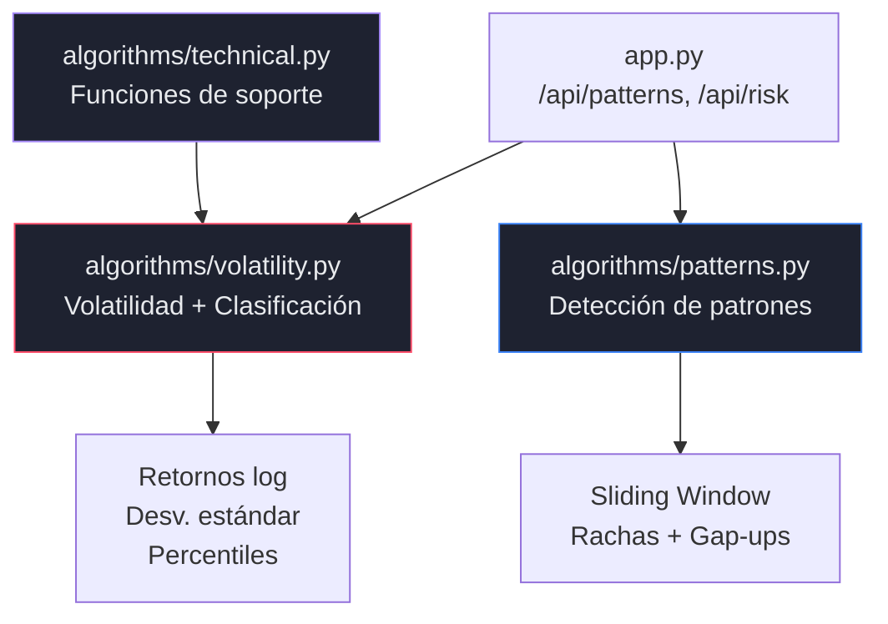
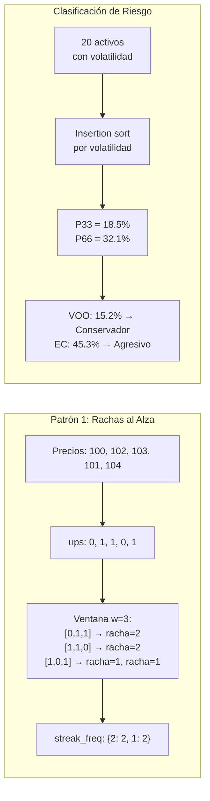

# Requerimiento 3 — Detección de Patrones y Clasificación de Riesgo por Volatilidad

---

## 1. Objetivo del Requerimiento

Implementar algoritmos basados en ventana deslizante (sliding window) para detectar patrones recurrentes en series de tiempo financieras, y calcular la volatilidad histórica de cada activo para clasificarlo en categorías de riesgo (Conservador, Moderado, Agresivo). Todo sin utilizar `pandas`, `numpy`, `scipy` ni funciones de alto nivel.

## 2. Problema que Resuelve

- **Detección de patrones**: Identificar comportamientos recurrentes como rachas alcistas consecutivas y gap-ups que pueden anticipar movimientos futuros del mercado.
- **Medición de riesgo**: Cuantificar la dispersión de los retornos de cada activo para determinar cuánto "se mueve" cada uno respecto a su media.
- **Clasificación de portafolio**: Segmentar los 20 activos en categorías de riesgo que permitan tomar decisiones de inversión informadas.

### 2.1 Entregables Exigidos por el PDF del Proyecto

El PDF establece textualmente: *"Como resultado, el sistema deberá generar un listado de activos ordenados según su nivel de riesgo, calculado de manera estrictamente algorítmica."*

**Cumplimiento en el sistema:**

| Entregable PDF | Implementación | Ubicación |
|----------------|---------------|-----------|
| Listado ordenado por riesgo | `classify_risk()` ordena con insertion sort manual por volatilidad y asigna `rank` | `algorithms/volatility.py` |
| Categorías (conservador, moderado, agresivo) | Clasificación por percentiles P33/P66 | `algorithms/volatility.py` — `classify_risk()` |
| Visible en la aplicación | Tabla HTML con ranking en `/risk` + barras de volatilidad Canvas | `templates/risk.html`, `dashboard.js` — `loadRiskPage()` |
| Exportable | Tabla de clasificación incluida en el reporte PDF | `visualization/pdf_export.py` — Sección 2 |
| Cálculo estrictamente algorítmico | Sin `sorted()`, sin `numpy` — todo manual con insertion sort e `math.sqrt` | Verificable en código fuente |

## 3. Arquitectura Involucrada



| Archivo | Responsabilidad |
|---------|----------------|
| `algorithms/patterns.py` | `detect_consecutive_ups()`, `detect_gap_ups()`, `scan_patterns()` |
| `algorithms/volatility.py` | `compute_historical_volatility()`, `classify_risk()`, `analyze_portfolio_risk()` |
| `algorithms/technical.py` | `compute_mean()`, `compute_std_dev()`, `compute_returns()`, `compute_sma()` |

## 4. Flujo Completo del Sistema

```mermaid
flowchart TB
    subgraph "Patrones (patterns.py)"
        P1["Recibir closes, opens, highs"] --> P2["Crear array binario<br/>ups[i] = 1 si close[i] > close[i-1]"]
        P2 --> P3["Recorrer con ventana<br/>deslizante de tamaño w"]
        P3 --> P4["Contar rachas de 1s<br/>consecutivos por ventana"]
        P4 --> P5["Registrar frecuencia<br/>por longitud de racha"]

        P1 --> G1["Crear array binario<br/>gaps[i] = 1 si open[i] > high[i-1]"]
        G1 --> G2["Acumulador deslizante<br/>O(n) optimizado"]
        G2 --> G3["Conteo por ventana<br/>gaps_per_window[]"]
    end

    subgraph "Volatilidad (volatility.py)"
        V1["Recibir precios<br/>por activo"] --> V2["compute_log_returns()<br/>r_i = ln(P_i/P_{i-1})"]
        V2 --> V3["Pasada 1: Media<br/>r̄ = (1/n)·Σr_i"]
        V3 --> V4["Pasada 2: Varianza<br/>σ² = (1/(n-1))·Σ(r_i - r̄)²"]
        V4 --> V5["Anualizar<br/>σ_anual = σ_diaria · √252"]
        V5 --> V6["classify_risk()<br/>Percentiles P33, P66"]
        V6 --> V7["Conservador / Moderado / Agresivo"]
    end
```



## 5. Explicación Detallada del Código

### 5.1 `algorithms/patterns.py`

#### `detect_consecutive_ups(closes, window_size=20)`

**Definición formal del patrón:** Una racha al alza de longitud k comenzando en posición i existe si:

$$\text{close}[i+j] > \text{close}[i+j-1] \quad \forall j \in \{1, 2, \ldots, k\}$$

**Algoritmo (dos fases):**

**Fase 1 — Preprocesamiento O(n):**
```python
ups = [0]  # posición 0 no tiene anterior
for i in range(1, n):
    if closes[i] > closes[i-1]:
        ups.append(1)    # día al alza
    else:
        ups.append(0)    # día no al alza
```

Transforma la serie de precios en un array binario. **Justificación**: Separar la clasificación (binaria) del recorrido con ventana simplifica la lógica y permite reutilizar `ups` para múltiples tamaños de ventana.

**Fase 2 — Sliding window O(n × w):**
```python
for start in range(n - w + 1):        # deslizar ventana
    current_streak = 0
    for j in range(start, start + w):  # recorrer ventana
        if ups[j] == 1:
            current_streak += 1         # extender racha
        else:
            if current_streak > 0:
                streak_freq[current_streak] += 1  # registrar racha
            current_streak = 0
    if current_streak > 0:              # racha al final de ventana
        streak_freq[current_streak] += 1
```

**Estructura de datos**: `streak_freq` es un `dict{int: int}` que mapea longitud de racha → frecuencia total. Acceso e inserción O(1).

#### `detect_gap_ups(opens, highs, window_size=20)`

**Definición formal:** Un gap-up en el día i existe si: $\text{open}[i] > \text{high}[i-1]$

**Optimización con acumulador deslizante O(n):**

A diferencia de `detect_consecutive_ups` que usa O(n × w) por recorrer cada ventana internamente, `detect_gap_ups` implementa un **acumulador deslizante**:

```python
# Suma de primera ventana
window_sum = sum(gaps[0:w])

# Deslizar: O(1) por paso
for start in range(1, n - w + 1):
    window_sum += gaps[start + w - 1]  # nuevo elemento entra
    window_sum -= gaps[start - 1]       # viejo elemento sale
```

**Justificación**: Como el patrón gap-up es binario (existe o no en cada posición), solo necesitamos el **conteo** dentro de la ventana, no la estructura de las rachas. Esto permite usar la técnica de suma deslizante en O(1) por desplazamiento.

### 5.2 `algorithms/volatility.py`

#### `compute_log_returns(prices)`

Idéntica en lógica a `compute_returns` en `technical.py`, pero con manejo adicional de tipos (`float()` explícito) y omisión silenciosa de valores inválidos. **Nota**: Esta duplicación es una mala práctica detectada.

#### `compute_historical_volatility(prices, annualize=True, trading_days=252)`

**Algoritmo (dos pasadas):**

```python
# 1. Calcular retornos logarítmicos
returns = compute_log_returns(prices)   # O(n)

# 2. Pasada 1: media
mean_r = sum(returns) / len(returns)    # O(n)

# 3. Pasada 2: varianza muestral
sum_sq = 0.0
for r in returns:
    diff = r - mean_r
    sum_sq += diff * diff               # O(n)
variance = sum_sq / (n - 1)            # Bessel's correction
std_dev = math.sqrt(variance)

# 4. Anualizar
if annualize:
    return std_dev * math.sqrt(trading_days)  # × √252
```

**Justificación de la corrección de Bessel** (dividir por n-1 en lugar de n): La desviación estándar muestral con n-1 es un estimador insesgado de la desviación estándar poblacional. Para n ≈ 1800, la diferencia es negligible (~0.03%), pero se implementa por rigor estadístico.

**Justificación de la anualización**: $\sigma_{anual} = \sigma_{diaria} \cdot \sqrt{252}$ asume independencia de retornos diarios (random walk). Permite comparar con benchmarks de la industria (volatilidad anualizada típica: 10-50%).

#### `classify_risk(volatilities_dict, low_pct=33, high_pct=66)`

**Algoritmo:**

1. Extraer volatilidades a una lista de items `{symbol, volatility}`.
2. **Insertion sort manual** por volatilidad ascendente (sin `sorted()`).
3. Calcular percentiles P33 y P66 con interpolación lineal.
4. Clasificar cada activo según umbrales.

**Cálculo de percentiles (interpolación lineal):**

Para el percentil p en una lista ordenada de n valores:

$$k = \frac{p}{100} \cdot (n - 1)$$
$$\text{percentil} = \text{values}[\lfloor k \rfloor] + (k - \lfloor k \rfloor) \cdot (\text{values}[\lfloor k \rfloor + 1] - \text{values}[\lfloor k \rfloor])$$

**Clasificación:**
- **Conservador**: volatilidad ≤ P33
- **Moderado**: P33 < volatilidad ≤ P66
- **Agresivo**: volatilidad > P66

### 5.3 `algorithms/technical.py` — Funciones de Soporte

#### `compute_sma(prices, window)` — Media Móvil Simple

**Algoritmo optimizado con acumulador deslizante:**

```python
# Suma inicial de primera ventana: O(w)
current_sum = sum(prices[0:window])
sma_values = [current_sum / window]

# Deslizar: O(1) por paso
for i in range(window, n):
    current_sum += prices[i]            # nuevo elemento
    current_sum -= prices[i - window]   # viejo elemento
    sma_values.append(current_sum / window)
```

**Complejidad**: O(n) en lugar de O(n × w) que resultaría de recalcular la suma completa en cada paso.

**Uso en el sistema**: Se calculan SMA(20) y SMA(50) para los gráficos de velas en el dashboard.

## 6. Fundamento Matemático

### 6.1 Retornos Logarítmicos

$$r_i = \ln\left(\frac{P_i}{P_{i-1}}\right)$$

### 6.2 Volatilidad Histórica

$$\sigma_{diaria} = \sqrt{\frac{1}{n-1} \sum_{i=1}^{n} (r_i - \bar{r})^2}$$

$$\sigma_{anual} = \sigma_{diaria} \cdot \sqrt{T}$$

donde $T = 252$ (días hábiles por año) y $\bar{r} = \frac{1}{n}\sum_{i=1}^{n} r_i$.

### 6.3 Percentiles por Interpolación Lineal

Dado un vector ordenado $V = [v_1, v_2, \ldots, v_n]$ y un percentil $p \in [0, 100]$:

$$k = \frac{p}{100} \cdot (n - 1), \quad f = k - \lfloor k \rfloor$$

$$P_p = v_{\lfloor k \rfloor + 1} + f \cdot (v_{\lfloor k \rfloor + 2} - v_{\lfloor k \rfloor + 1})$$

### 6.4 Media Móvil Simple

$$\text{SMA}(i, w) = \frac{1}{w} \sum_{j=i-w+1}^{i} P_j$$

Con la propiedad de actualización incremental:

$$\text{SMA}(i+1, w) = \text{SMA}(i, w) + \frac{P_{i+1} - P_{i-w+1}}{w}$$

## 7. Complejidad Algorítmica

| Algoritmo | Temporal | Espacial | Peor Caso | Caso Promedio |
|-----------|----------|----------|-----------|---------------|
| `detect_consecutive_ups` | O(n × w) | O(n) | w grande | w=20: O(n) |
| `detect_gap_ups` | O(n) | O(n) | Siempre O(n) | Acumulador deslizante |
| `compute_log_returns` | O(n) | O(n) | O(n) | O(n) |
| `compute_historical_volatility` | O(n) | O(n) | 2 pasadas | O(n) |
| `classify_risk` (insertion sort) | O(k²) | O(k) | k=20: 400 ops | Trivial |
| `compute_mean` | O(n) | O(1) | O(n) | O(n) |
| `compute_std_dev` | O(n) | O(1) | 2 pasadas | O(n) |
| `compute_sma` | O(n) | O(n) | O(n) | Acumulador deslizante |
| `analyze_portfolio_risk` | O(k × n) | O(k × n) | k=20, n≈1800 | ~36,000 retornos |

**Optimización potencial de `detect_consecutive_ups`**: Actualmente O(n × w) porque recorre cada ventana internamente contando rachas. Podría reducirse a O(n) precalculando las longitudes de racha con un solo recorrido y luego mapeando cada ventana a las rachas que contiene.

## 8. Estructuras de Datos Utilizadas

| Estructura | Uso | Justificación |
|------------|-----|---------------|
| `list[int]` (array binario `ups`) | Preprocesamiento de subidas | Acceso O(1), compacto |
| `list[int]` (array binario `gaps`) | Preprocesamiento de gap-ups | Acceso O(1), compacto |
| `dict{int: int}` (`streak_freq`) | Frecuencia de rachas por longitud | Inserción y consulta O(1) |
| `list[int]` (`gap_positions`) | Posiciones de gap-ups | Preserva orden cronológico |
| `list[int]` (`gaps_per_window`) | Gap-ups por ventana | Resultado del acumulador deslizante |
| `list[dict]` | Clasificación de activos por riesgo | Ordenable, serializable a JSON |
| `list[float]` | Retornos logarítmicos | Acceso O(1), iterable |

## 9. Restricciones Cumplidas

| Restricción | Cumplimiento | Evidencia |
|-------------|-------------|-----------|
| NO `numpy.std()` | ✅ | Desviación estándar manual en `compute_historical_volatility` |
| NO `pandas.rolling()` | ✅ | Ventana deslizante con bucle `for` manual |
| NO `scipy.stats.percentileofscore` | ✅ | Percentil con interpolación lineal manual |
| NO `sorted()` | ✅ | Insertion sort manual en `classify_risk` |
| Implementación explícita de SMA | ✅ | Acumulador deslizante en `compute_sma` |
| Solo `math` estándar | ✅ | `math.log`, `math.sqrt` |

## 10. Justificación de Decisiones Técnicas

### 10.1 Ventana deslizante vs análisis global

La ventana deslizante permite detectar **frecuencia temporal** de patrones, no solo su existencia. Una racha de 5 días al alza tiene significado diferente si ocurre 50 veces vs 5 veces en 7 años.

### 10.2 Insertion sort para clasificación de riesgo

Con k = 20 activos, insertion sort O(k²) = O(400) es trivial. Usar merge sort o quicksort sería overengineering para este tamaño, y la restricción prohíbe `sorted()`.

### 10.3 Percentiles P33/P66 para clasificación

Dividir en terciles (33/66) asigna aproximadamente 7/7/6 activos por categoría para k=20. Esto provee una distribución balanceada. Alternativas como la desviación estándar (σ) del portafolio requerirían un umbral absoluto que no se adapta a la distribución real.

### 10.4 Logaritmo natural vs base 10

Se usa `math.log()` (ln) para retornos porque:
1. Es la convención estándar en finanzas cuantitativas.
2. La propiedad de aditividad temporal solo se cumple con ln.
3. Para variaciones pequeñas, $\ln(1+r) \approx r$, lo que facilita la interpretación.

## 11. Diagramas



## 12. Posibles Mejoras

1. **Más patrones**: Implementar head-and-shoulders, double top/bottom, o cruces de medias móviles (golden cross/death cross).
2. **Ventana adaptativa**: Ajustar el tamaño de ventana dinámicamente según la volatilidad del activo.
3. **Optimización de rachas a O(n)**: Precalcular longitudes de racha en una sola pasada, luego mapear ventanas sin recorrer internamente.
4. **EWMA**: Implementar volatilidad con media móvil exponencial (Exponentially Weighted Moving Average) que da más peso a observaciones recientes.
5. **VaR (Value at Risk)**: Complementar la clasificación con la métrica VaR que estima la pérdida máxima esperada a un nivel de confianza dado.
6. **Corrección de duplicación**: `compute_log_returns` en `volatility.py` duplica `compute_returns` de `technical.py`. Debería importarse desde `technical.py`.
