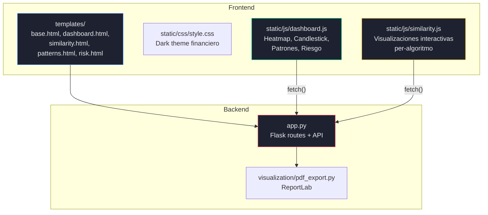
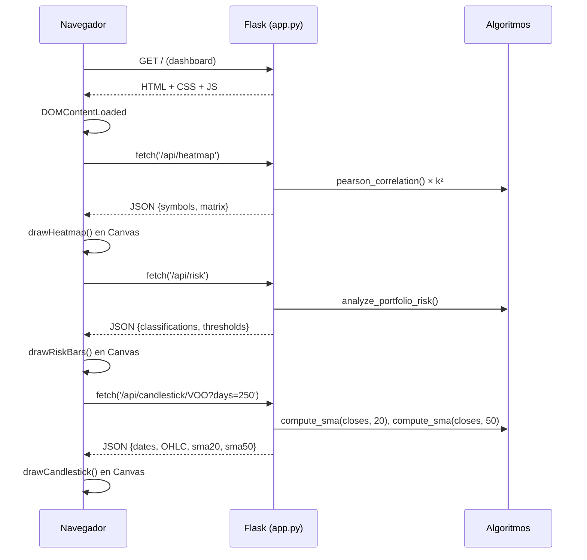
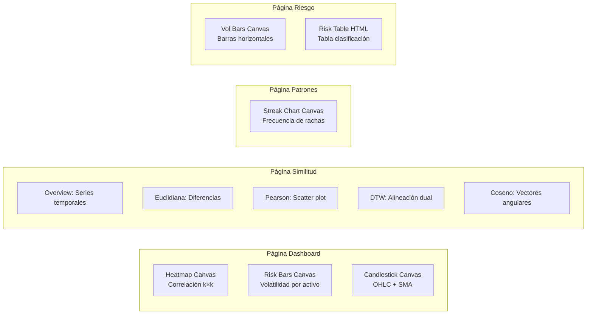

# Requerimiento 4 — Dashboard de Visualización y Exportación PDF

---

## 1. Objetivo del Requerimiento

Construir un dashboard web interactivo que presente visualizaciones financieras profesionales (heatmap de correlación, gráficos de velas con medias móviles, gráficos de patrones, ranking de riesgo) y permita la exportación de resultados a PDF. Todas las visualizaciones deben renderizarse con Canvas API nativo del navegador, sin usar Plotly, Chart.js, Bokeh, Matplotlib ni ninguna librería de gráficos.

## 2. Problema que Resuelve

- **Interpretación visual**: Los datos numéricos de similitud, patrones y volatilidad son difíciles de interpretar en forma tabular. Las visualizaciones permiten identificar patrones a simple vista.
- **Interactividad**: El usuario necesita seleccionar activos, periodos y algoritmos dinámicamente.
- **Comunicación de resultados**: La exportación PDF permite entregar reportes formales para evaluación académica.
- **Restricción de librerías**: La prohibición de librerías de gráficos obliga a implementar toda la renderización manualmente con Canvas API.

## 3. Arquitectura Involucrada



## 4. Flujo Completo del Sistema

### 4.1 Flujo de Renderizado de Visualizaciones



## 5. Explicación Detallada del Código

### 5.1 Templates HTML (Jinja2)

#### `templates/base.html` — Layout Base

Define la estructura compartida por todas las páginas:
- **Sidebar fija** (240px) con navegación: Dashboard, Similitud, Patrones, Riesgo.
- **Top bar** con título de página, botón "Exportar PDF" y badge de conteo de activos.
- **Content area** donde cada página inyecta su contenido via ``.

**Decisión de diseño**: Template inheritance de Jinja2 (``) evita duplicación de HTML y garantiza consistencia visual.

#### `templates/dashboard.html` — Página Principal

Layout de 2 columnas (`grid-2`):
- **Columna izquierda**: Heatmap de correlación (Canvas).
- **Columna derecha**: Resumen de riesgo (pills + barras Canvas).
- **Fila completa**: Gráfico de velas (Canvas) con selectores de activo y periodo.

Carga automática al `DOMContentLoaded`: `loadHeatmap()`, `loadRiskSummary()`, `loadCandlestick()`.

#### `templates/similarity.html` — Similitud Interactiva

- Selectores de activos A y B.
- **4 metric cards** clickeables (Euclidiana, Pearson, DTW, Coseno) con `onclick="selectAlgorithm('...')"`.
- Área de visualización Canvas que cambia según el algoritmo seleccionado.
- Panel de explicación matemática (`algo-explanation`) que aparece con animación CSS.

#### `templates/patterns.html` — Detección de Patrones

- Selectores de activo y tamaño de ventana (10, 20, 30, 50 días).
- **Grid 2 columnas**: Rachas al alza (con gráfico de barras Canvas) y Gap-ups (con estadísticas).
- Mini-stats: total días al alza, racha más larga, ventanas analizadas.

#### `templates/risk.html` — Clasificación de Riesgo

- **3 metric cards** coloreadas: Conservador (verde), Moderado (amarillo), Agresivo (rojo).
- Gráfico de barras horizontales Canvas con volatilidad por activo.
- Tabla HTML con ranking completo.

### 5.2 `static/css/style.css` — Sistema de Diseño

**Tema oscuro financiero** con variables CSS:

| Variable | Valor | Uso |
|----------|-------|-----|
| `--bg-primary` | `#0f1117` | Fondo principal |
| `--bg-card` | `#1e2230` | Fondo de cards |
| `--accent-green` | `#00d68f` | Alcista, Conservador |
| `--accent-red` | `#ff4d6a` | Bajista, Agresivo |
| `--accent-blue` | `#3b82f6` | Serie A, enlaces |
| `--accent-yellow` | `#fbbf24` | Moderado, warnings |
| `--accent-purple` | `#a78bfa` | SMA50, DTW path |

**Componentes implementados**: cards con hover effect, grids responsivos (2 y 4 columnas), metric cards animadas, risk pills, data tables, spinner de carga, sidebar con gradiente, botones con gradiente.

**Responsividad**: Media queries para ≤1100px (grid a 1 columna) y ≤768px (sidebar oculta).

**Animaciones**: `fadeSlideUp` para paneles de explicación, `spin` para spinner de carga, transiciones CSS en hover de cards (translateY, box-shadow).

### 5.3 `static/js/dashboard.js` — Renderización Canvas

#### `drawHeatmap(symbols, matrix)`

Renderiza una matriz de correlación de Pearson k×k en Canvas:

1. **Dimensionamiento**: `cellSize = 28px`, `labelW = 50px`. Canvas de `(50 + k×28) × (50 + k×28)`.
2. **Labels**: Nombres de activos en eje Y (horizontal) y eje X (rotados 45°).
3. **Celdas**: Cada celda coloreada con `heatColor(val)`:
   ```javascript
   function heatColor(val) {
     if (val >= 0) {
       r = 255 * (1 - val); g = 255 * (1 - val*0.4); b = 255;  // azul
     } else {
       r = 255; g = 255 * (1 + val*0.4); b = 255 * (1 + val);  // rojo
     }
   }
   ```
   Esquema divergente: rojo (-1) → blanco (0) → azul (+1).
4. **Valores**: Texto del coeficiente (2 decimales) centrado en cada celda, con color adaptativo (blanco si |val| > 0.5, negro si no).

#### `drawCandlestick(data)`

Renderiza un gráfico de velas japonesas OHLC con medias móviles:

1. **Rangos**: Encuentra min(Low) y max(High) para escalar el eje Y.
2. **Grid**: 5 líneas horizontales con etiquetas de precio en el eje Y.
3. **Velas**: Para cada día:
   - **Mecha** (wick): línea vertical de Low a High.
   - **Cuerpo**: rectángulo entre Open y Close. Verde si bullish (Close ≥ Open), rojo si bearish.
4. **SMA**: Líneas continuas para SMA(20) (azul) y SMA(50) (violeta).
5. **Fechas**: Labels del eje X cada `n/8` días.

#### `drawRiskBars(items, canvasId)`

Barras horizontales de volatilidad con colores por categoría de riesgo:

1. Escala proporcional al `maxVol`.
2. Labels de activo a la izquierda.
3. Barras redondeadas (`roundRect`) con color: verde (Conservador), amarillo (Moderado), rojo (Agresivo).
4. Valor porcentual a la derecha de cada barra.

#### `drawStreakChart(freq)`

Gráfico de barras verticales para frecuencia de rachas por longitud:

1. Keys ordenadas con **insertion sort manual** (sin `Array.sort()`).
2. Barras con gradiente azul (más oscuro en la base).
3. Labels superiores con el valor, labels inferiores con la longitud de racha.

### 5.4 `static/js/similarity.js` — Visualizaciones Per-Algoritmo

Cada algoritmo tiene su propia visualización Canvas activada al hacer click en su metric card:

| Algoritmo | Visualización | Elementos |
|-----------|---------------|-----------|
| Euclidiana | Retornos con diferencias punto a punto | Líneas azul/roja + barras amarillas de distancia |
| Pearson | Scatter plot de retornos A vs B | Puntos azules + línea de regresión verde punteada |
| DTW | Alineación temporal dual | Series A (arriba) y B (abajo) + conexiones violeta |
| Coseno | Diagrama vectorial angular | Vectores A y B desde origen + arco de ángulo θ |

**Función `selectAlgorithm(algo)`**: Activa la card, dibuja la visualización correspondiente, y muestra el panel de explicación matemática con fórmula y interpretación financiera.

### 5.5 `visualization/pdf_export.py` — Generación PDF

**Librería**: ReportLab (librería de bajo nivel permitida por las restricciones).

**Secciones del PDF:**

1. **Portada**: Título, número de activos, periodo, fecha de generación.
2. **Resumen ETL**: Descripción del pipeline, lista de activos (tabla 5 columnas), restricciones cumplidas.
3. **Clasificación de Riesgo**: Umbrales P33/P66, tabla completa con colores por categoría.
4. **Patrones Detectados**: Tabla con total días al alza, racha máxima, gap-ups y ventanas analizadas para cada activo.
5. **Algoritmos Implementados**: Tabla con nombre, tipo, complejidad temporal y espacial.

**Estilos personalizados**: Colores corporativos (`#1a1d28`, `#00d68f`), fuentes Helvetica con pesos Bold y Normal, tablas con header oscuro y filas alternadas.

## 6. Fundamento Matemático de las Visualizaciones

### 6.1 Heatmap — Mapeo de Color

Función de color divergente para $r \in [-1, 1]$:

$$\text{RGB}(r) = \begin{cases} (255(1-r), 255(1-0.4r), 255) & r \geq 0 \\ (255, 255(1+0.4r), 255(1+r)) & r < 0 \end{cases}$$

### 6.2 Candlestick — Escala Y

$$y_{pixel}(v) = \text{padTop} + \text{chartH} - \frac{v - \text{Low}_{min}}{\text{High}_{max} - \text{Low}_{min}} \times \text{chartH}$$

### 6.3 Regresión Lineal (Scatter Pearson)

$$\hat{\beta} = \frac{\sum x_i y_i - n\bar{x}\bar{y}}{\sum x_i^2 - n\bar{x}^2}, \quad \hat{\alpha} = \bar{y} - \hat{\beta}\bar{x}$$

### 6.4 Coseno — Ángulo entre Vectores

$$\theta = \arccos(\cos(\theta)) = \arccos\left(\frac{\mathbf{a} \cdot \mathbf{b}}{\|\mathbf{a}\|\|\mathbf{b}\|}\right)$$

Convertido a grados: $\theta_{deg} = \theta \times \frac{180}{\pi}$

## 7. Complejidad Algorítmica

| Componente | Temporal | Espacial | Notas |
|------------|----------|----------|-------|
| Heatmap API (backend) | O(k² × n) | O(k²) | k=20, n≈1800 |
| Heatmap Canvas (frontend) | O(k²) | O(1) | 400 celdas |
| Candlestick Canvas | O(n) | O(1) | n ≤ 500 días |
| Risk bars Canvas | O(k) | O(1) | k=20 barras |
| Streak chart Canvas | O(r) | O(r) | r = tipos de racha |
| Similarity Canvas | O(n) | O(1) | Todos los tipos |
| PDF generation | O(k × n) | O(k × n) | Recalcula patrones y riesgo |

## 8. Estructuras de Datos Utilizadas

| Estructura | Componente | Justificación |
|------------|------------|---------------|
| `list[list[float]]` (matrix) | Heatmap | Acceso O(1) por `[i][j]` |
| JSON response objects | Todas las APIs | Serializable, acceso O(1) por clave |
| `_CACHE` dict (server-side) | Heatmap, Risk | Evita recalcular en cada request |
| `dict{int: int}` | Streak frequency | Mapeo racha→frecuencia |
| ReportLab `Paragraph`, `Table` | PDF | Flujo de documento profesional |

## 9. Restricciones Cumplidas

| Restricción | Cumplimiento | Evidencia |
|-------------|-------------|-----------|
| NO Plotly | ✅ | Canvas API nativo en `dashboard.js`, `similarity.js` |
| NO Chart.js | ✅ | Todos los gráficos con `ctx.fillRect`, `ctx.lineTo`, etc. |
| NO Bokeh | ✅ | Sin dependencias de gráficos en frontend |
| NO Matplotlib | ✅ | Sin rendering server-side de imágenes |
| NO `sorted()` en JS | ✅ | Insertion sort manual para keys del streak chart |
| Gráficos manuales | ✅ | Heatmap, candlestick, barras, scatter, vectores — todo manual |

## 10. Justificación de Decisiones Técnicas

### 10.1 Canvas API vs SVG

**Elegida**: Canvas API (bitmap rendering).

**Ventajas**: Alto rendimiento para muchos elementos (400 celdas del heatmap), API simple para formas geométricas, no genera DOM pesado.

**Desventajas**: No interactivo por defecto (no hay event listeners en elementos individuales), pierde definición al escalar.

### 10.2 Dark theme financiero

**Justificación**: Las plataformas financieras profesionales (Bloomberg, TradingView, Refinitiv) usan temas oscuros porque: reducen fatiga visual en sesiones prolongadas, mejoran el contraste de gráficos coloridos, y transmiten profesionalismo.

### 10.3 ReportLab vs alternativas

**Elegida**: ReportLab (librería de bajo nivel para PDF).

**Justificación**: No encapsula algoritmos financieros ni de análisis; solo genera documentos PDF. Permite control pixel-perfect sobre el layout. `weasyprint` o `pdfkit` requerirían HTML→PDF (más dependencias). `fpdf` tiene menos features de estilo.

### 10.4 Cache server-side

El heatmap y la clasificación de riesgo se cachean en `_CACHE` dict al primer request. **Justificación**: Calcular el heatmap requiere O(k²×n) ≈ 720,000×n operaciones de Pearson. Sin caché, cada visita al dashboard recalcularía esto (~2-3 segundos). Con caché, la respuesta es instantánea.

## 11. Diagramas

### 11.1 Arquitectura de Visualizaciones



## 12. Posibles Mejoras

1. **Tooltips interactivos**: Implementar detección de posición del mouse sobre Canvas para mostrar valores al hacer hover sobre celdas del heatmap o velas.
2. **Zoom y pan**: Agregar controles de zoom al gráfico de velas para explorar rangos temporales específicos.
3. **WebSocket para datos en tiempo real**: Reemplazar polling con WebSocket para actualizaciones automáticas del dashboard.
4. **Gráficos SVG opcionales**: Para elementos que requieren interactividad individual (tooltips, click handlers por celda).
5. **PDF con gráficos embebidos**: Actualmente el PDF solo contiene tablas. Podría incluir gráficos renderizados server-side con ReportLab Drawing.
6. **Responsividad del Canvas**: Los Canvas no se re-renderizan al cambiar el tamaño de ventana. Agregar `ResizeObserver` para re-dibujar automáticamente.
7. **Accesibilidad**: Los gráficos Canvas no son accesibles a screen readers. Agregar `aria-label` y tablas de datos alternativas.
