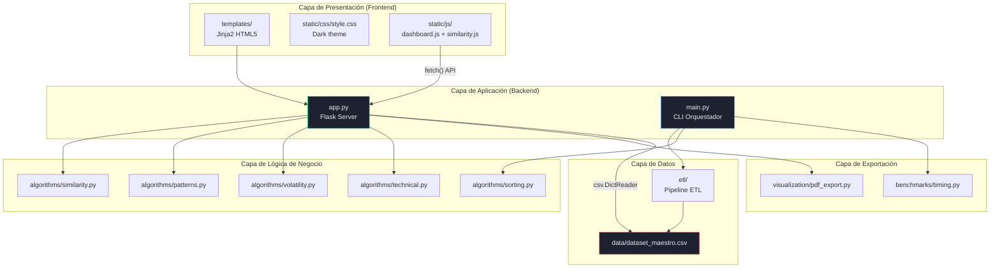
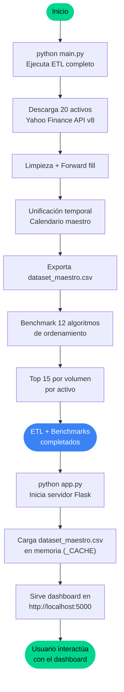
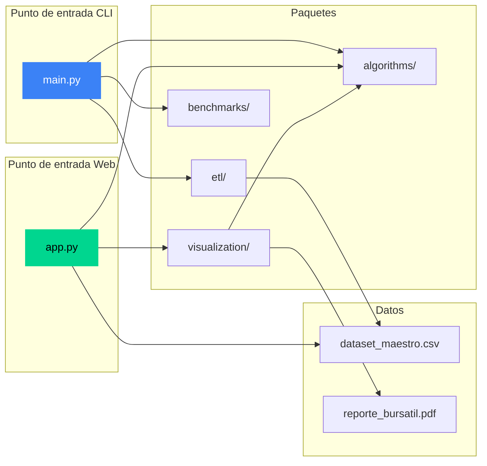

# Requerimiento 5 — Despliegue, Arquitectura Web y Ejecución del Sistema

---

## 1. Objetivo del Requerimiento

Integrar todos los módulos del proyecto en una aplicación web funcional desplegable, con backend Flask, frontend HTML/CSS/JS vanilla, APIs REST para comunicación entre capas, y soporte para ejecución local y en producción. Incluir guía completa de instalación, ejecución y despliegue.

## 2. Problema que Resuelve

- **Integración**: Conectar el pipeline ETL, los algoritmos de análisis, las visualizaciones y la exportación PDF en una aplicación cohesiva.
- **Accesibilidad**: Permitir que usuarios no técnicos interactúen con los algoritmos a través de una interfaz web.
- **Despliegue**: Soportar ejecución tanto en desarrollo local como en plataformas cloud (Render, Railway).
- **Reproducibilidad**: Garantizar que el sistema completo pueda reconstruirse desde cero con un mínimo de pasos.

## 3. Arquitectura Involucrada

### 3.1 Arquitectura General del Sistema



### 3.2 Separación de Responsabilidades

| Capa | Archivos | Responsabilidad |
|------|----------|----------------|
| **Presentación** | `templates/`, `static/` | Renderización visual, interacción de usuario |
| **Aplicación** | `app.py` | Routing HTTP, serialización JSON, servir HTML |
| **Lógica** | `algorithms/` | Algoritmos puros sin dependencia de HTTP ni UI |
| **Datos** | `etl/`, `data/` | Adquisición, limpieza y almacenamiento de datos |
| **Exportación** | `visualization/`, `benchmarks/` | Generación de reportes y mediciones |
| **Configuración** | `config.py`, `requirements.txt`, `Procfile` | Constantes, dependencias, despliegue |

## 4. Flujo Completo del Sistema

### 4.1 Flujo de Ejecución Completo



### 4.2 Dos Puntos de Entrada

| Script | Propósito | Cuándo usar |
|--------|-----------|-------------|
| `main.py` | ETL + Benchmarks de ordenamiento (CLI) | Primera ejecución o actualización de datos |
| `app.py` | Servidor web Flask (Dashboard) | Después de tener `dataset_maestro.csv` |

## 5. Explicación Detallada del Código

### 5.1 `app.py` — Servidor Flask

#### Configuración e Inicialización

```python
app = Flask(__name__, static_folder="static", template_folder="templates")
```

Flask sirve archivos estáticos desde `static/` y renderiza templates Jinja2 desde `templates/`.

#### Sistema de Caché

```python
_CACHE = {}

def _load_dataset():
    if "rows" in _CACHE:
        return _CACHE["rows"], _CACHE["symbols"]
    # Cargar CSV, detectar símbolos, insertion sort manual
    _CACHE["rows"] = rows
    _CACHE["symbols"] = symbols
```

**Patrón singleton en memoria**: El dataset se carga una sola vez y se almacena en `_CACHE`. Las respuestas costosas (heatmap, riesgo) también se cachean tras el primer cálculo.

#### Rutas de Páginas HTML

| Ruta | Función | Template |
|------|---------|----------|
| `GET /` | `page_dashboard()` | `dashboard.html` |
| `GET /similarity` | `page_similarity()` | `similarity.html` |
| `GET /patterns` | `page_patterns()` | `patterns.html` |
| `GET /risk` | `page_risk()` | `risk.html` |

Todas cargan el dataset y pasan `symbols` al template para poblar selectores.

#### API REST (JSON)

| Endpoint | Método | Parámetros | Respuesta |
|----------|--------|------------|-----------|
| `/api/symbols` | GET | — | `{symbols: [...]}` |
| `/api/similarity` | GET | `a=VOO&b=SPY` | Métricas + datos de gráficos + datos extra |
| `/api/heatmap` | GET | — | `{symbols, matrix}` (cacheado) |
| `/api/candlestick/<symbol>` | GET | `days=250` | OHLCV + SMA20 + SMA50 |
| `/api/patterns/<symbol>` | GET | `window=20` | Rachas + gap-ups |
| `/api/risk` | GET | — | Clasificación completa (cacheado) |
| `/export/pdf` | GET | — | Descarga `reporte_bursatil.pdf` |

#### API de Similitud (detalle)

El endpoint `/api/similarity` es el más complejo. Además de las 4 métricas básicas, calcula y devuelve:

- **Precios alineados muestreados** (máx 200 puntos) para el gráfico de series.
- **Retornos muestreados** y **diferencias punto a punto** para la visualización Euclidiana.
- **DTW warping path muestreado** (~60 puntos) para la visualización DTW.
- **Normas y producto punto** para la visualización Coseno.

**Muestreo**: Se usa `step = len(data) // max_pts` para reducir los datos enviados al frontend, evitando transmitir 1800+ puntos por serie.

#### Punto de Entrada del Servidor

```python
if __name__ == "__main__":
    port = int(os.environ.get("PORT", 5000))
    if os.environ.get("RENDER") or os.environ.get("RAILWAY_ENVIRONMENT"):
        from waitress import serve
        serve(app, host="0.0.0.0", port=port)  # Producción
    else:
        app.run(debug=True, host="0.0.0.0", port=port)  # Desarrollo
```

**Detección automática de entorno**: Si se detectan variables de entorno de Render o Railway, usa `waitress` (servidor WSGI de producción). Si no, usa el servidor de desarrollo de Flask con `debug=True`.

### 5.2 `main.py` — Orquestador CLI

**Flujo principal:**

1. **Parse de argumentos** (manual, sin `argparse`): `--skip-etl`, `--symbols`.
2. **ETL**: Ejecuta `run_etl()` o carga CSV existente.
3. **Por activo**: Construye registros, ejecuta benchmark de 12 algoritmos de ordenamiento, extrae Top 15 por volumen.
4. **Benchmark agregado**: Todos los registros combinados, diagrama ASCII.
5. **Exportación**: Resultados a `benchmark_results.csv`.

**Función key multi-criterio** (`multi_key_date_close`):

```python
def multi_key_date_close(record):
    date_compact = (year - 2000) * 366 + (month - 1) * 31 + day
    close_cents = int(round(record["Close"] * 100))
    return date_compact * 100_000 + close_cents
```

**Decisión de diseño**: Codifica fecha + precio como un único entero para compatibilidad con algoritmos no-comparativos (Pigeonhole, Radix) que requieren valores enteros. El multiplicador 100,000 garantiza que `close_cents` (< 100,000 para precios < $1000) nunca interfiere con la parte de fecha.

### 5.3 `benchmarks/timing.py` — Medición de Rendimiento

- `measure_algorithm()`: Copia los datos (O(n)), mide tiempo con `time.perf_counter()` (resolución de nanosegundos), ejecuta el algoritmo sobre la copia.
- `verify_results()`: Compara todas las salidas ordenadas para verificar consistencia entre algoritmos.
- `print_bar_chart()`: Diagrama de barras ASCII con insertion sort manual por tiempo.
- `export_results_csv()`: Exporta a CSV con `csv.DictWriter`.

### 5.4 `algorithms/sorting.py` — 12 Algoritmos de Ordenamiento

Implementa 12 algoritmos registrados mediante un decorador `@_register(name)`:

| # | Algoritmo | Complejidad Temporal | Espacial | Tipo |
|---|-----------|---------------------|----------|------|
| 1 | TimSort | O(n log n) | O(n) | Híbrido (runs + merge) |
| 2 | Comb Sort | O(n²/2^p) | O(1) | Comparativo in-place |
| 3 | Selection Sort | O(n²) | O(1) | Comparativo in-place |
| 4 | Tree Sort (BST) | O(n log n) avg | O(n) | Basado en árbol |
| 5 | Pigeonhole Sort | O(n + rango) | O(rango) | Distribución |
| 6 | Bucket Sort | O(n + k) avg | O(n + k) | Distribución |
| 7 | QuickSort | O(n log n) avg | O(log n) | Comparativo (mediana de 3) |
| 8 | HeapSort | O(n log n) | O(1) | Comparativo in-place |
| 9 | Bitonic Sort | O(n log² n) | O(1) | Red de ordenamiento |
| 10 | Gnome Sort | O(n²) | O(1) | Comparativo in-place |
| 11 | Binary Insertion Sort | O(n²) shifts | O(1) | Comparativo (búsqueda binaria) |
| 12 | Radix Sort (LSD) | O(d × n) | O(n + b) | No comparativo |

**Patrón de registro**: El decorador `@_register("NombreAlgoritmo")` añade cada función al diccionario `ALGORITHMS`, permitiendo ejecución dinámica por nombre via `run_sort(name, data, key)`.

## 6. Configuración del Proyecto

### 6.1 `config.py` — Constantes Globales

| Constante | Valor | Propósito |
|-----------|-------|-----------|
| `PROJECT_ROOT` | Auto-detectado | Ruta raíz del proyecto |
| `DATASET_CSV` | `data/dataset_maestro.csv` | Ruta del dataset |
| `ASSET_SYMBOLS` | 20 símbolos | Portafolio de activos |
| `START_YEARS_BACK` | 7 | Años de historia |
| `FETCH_DELAY_SECONDS` | 0.3 | Pausa entre HTTP requests |
| `FETCH_TIMEOUT_SECONDS` | 90 | Timeout por petición |
| `FETCH_MAX_RETRIES` | 3 | Reintentos por activo |
| `SMA_WINDOWS` | [20, 50] | Periodos de medias móviles |
| `TRADING_DAYS_PER_YEAR` | 252 | Días hábiles anuales |
| `RISK_PERCENTILE_LOW` | 33 | Umbral conservador |
| `RISK_PERCENTILE_HIGH` | 66 | Umbral agresivo |
| `DEFAULT_WINDOW_SIZE` | 20 | Ventana deslizante por defecto |

### 6.2 `requirements.txt` — Dependencias

```
flask>=3.0
reportlab>=4.0
waitress>=2.1
```

**Solo 3 dependencias externas**. Todo lo demás usa la biblioteca estándar de Python.

### 6.3 `Procfile` — Despliegue Cloud

```
web: python app.py
```

Compatible con Heroku, Render y Railway. El script `app.py` detecta automáticamente el entorno y usa `waitress` en producción.

### 6.4 `.gitignore`

Excluye: `__pycache__/`, entornos virtuales, archivos IDE, archivos OS. Incluye el dataset y PDF generados (comentados opcionales para excluirlos).

## 7. Guía de Instalación y Ejecución

### 7.1 Requisitos Previos

- **Python 3.10+**
- Conexión a Internet (para el ETL)

### 7.2 Instalación

```bash
# 1. Clonar el repositorio
git clone <url-del-repo>
cd Algoritmos-ETL

# 2. Crear entorno virtual (recomendado)
python -m venv venv
venv\Scripts\activate    # Windows
# source venv/bin/activate  # Linux/Mac

# 3. Instalar dependencias
pip install -r requirements.txt
```

### 7.3 Ejecución del ETL

```bash
python main.py
```

**Tiempo estimado**: 2-3 minutos (descarga de 20 activos con rate limiting).

**Salida**: `data/dataset_maestro.csv` (~2.8 MB, ~1800 filas × 101 columnas).

**Opciones**:
- `--skip-etl`: Omite descarga, usa CSV existente.
- `--symbols VOO SPY EC`: Analiza solo activos específicos.

### 7.4 Inicio del Dashboard

```bash
python app.py
```

**URL**: `http://localhost:5000`

**Modo desarrollo**: Hot reload con `debug=True`.

### 7.5 Exportación PDF

**Opción 1**: Click en "Exportar PDF" en el dashboard.

**Opción 2**: Directamente desde terminal:
```bash
python -m visualization.pdf_export
```

**Salida**: `data/reporte_bursatil.pdf`

### 7.6 Despliegue en Producción

El sistema detecta automáticamente plataformas cloud:

```python
if os.environ.get("RENDER") or os.environ.get("RAILWAY_ENVIRONMENT"):
    from waitress import serve
    serve(app, host="0.0.0.0", port=port)
```

**Variables de entorno**:
- `PORT`: Puerto del servidor (default: 5000).
- `RENDER`: Detecta Render.
- `RAILWAY_ENVIRONMENT`: Detecta Railway.

## 8. Diagrama de Interacción de Módulos



## 9. Restricciones Cumplidas

| Restricción | Cumplimiento | Evidencia |
|-------------|-------------|-----------|
| Sin `yfinance` | ✅ | `urllib.request` en `data_fetcher.py` |
| Sin `pandas` | ✅ | `csv` + `dict/list` nativos |
| Sin `numpy`/`scipy`/`sklearn` | ✅ | Solo `math` estándar |
| Sin `plotly`/`bokeh`/`chart.js` | ✅ | Canvas API nativo |
| Sin `sorted()`/`list.sort()` | ✅ | Insertion sort manual en todo el código |
| Sin datasets estáticos | ✅ | ETL descarga datos frescos |
| Reproducibilidad | ✅ | `python main.py && python app.py` |
| Mínimo 20 activos | ✅ | 20 símbolos configurados |
| Mínimo 5 años | ✅ | 7 años de historia |

## 10. Análisis de Acoplamiento y Cohesión

### 10.1 Cohesión (Alta ✅)

Cada módulo tiene una responsabilidad única y bien definida:
- `data_fetcher.py` solo hace HTTP y parsing JSON.
- `data_cleaner.py` solo detecta y corrige datos.
- `similarity.py` solo implementa algoritmos de similitud.
- `patterns.py` solo detecta patrones con sliding window.

### 10.2 Acoplamiento

**Acoplamiento bajo** (deseable) entre:
- `algorithms/` y `etl/` — No se importan mutuamente.
- `algorithms/` y `visualization/` — Solo `pdf_export.py` importa de `algorithms/`.

**Acoplamiento moderado** (aceptable) entre:
- `app.py` y `algorithms/` — El servidor importa funciones de 4 módulos de algoritmos.
- `similarity.py` y `technical.py` — `compare_two_assets` importa `compute_returns`.

**Acoplamiento innecesario** (mejorable):
- `volatility.py` duplica `compute_log_returns` en lugar de importar de `technical.py`.
- `etl_pipeline.py` duplica `ASSET_SYMBOLS` de `config.py`.

## 11. Posibles Mejoras

### 11.1 Arquitectura
- **Separar API de rendering**: Mover endpoints `/api/*` a un Blueprint Flask separado.
- **Unificar configuración**: Eliminar duplicación de `ASSET_SYMBOLS` y constantes entre `config.py` y `etl_pipeline.py`.
- **Inyección de dependencias**: Pasar el dataset como argumento a las funciones de API en lugar de usar `_CACHE` global.

### 11.2 Despliegue
- **Docker**: Crear `Dockerfile` para despliegue containerizado consistente.
- **CI/CD**: Agregar GitHub Actions para ejecutar tests y desplegar automáticamente.
- **Variables de entorno**: Usar `.env` file con `python-dotenv` para configuración local.

### 11.3 Testing
- **pytest**: Migrar los bloques `if __name__ == "__main__"` a tests pytest formales.
- **Cobertura**: Agregar `pytest-cov` para medir cobertura de código.
- **Tests de integración**: Verificar que los endpoints API retornan datos correctos.

### 11.4 Rendimiento
- **Lazy loading**: Cargar el dataset bajo demanda en lugar de al inicio.
- **Compresión gzip**: Habilitar compresión en las respuestas JSON.
- **CDN para fonts**: Google Fonts ya se carga desde CDN pero podría auto-hosted para resiliencia.

### 11.5 Seguridad
- **CSRF protection**: Flask-WTF para formularios (actualmente no hay formularios POST).
- **Rate limiting**: Limitar requests a las APIs para prevenir abuso.
- **Input validation**: Validar más estrictamente los parámetros de las APIs.

## 12. Declaración de Uso de Inteligencia Artificial Generativa

El PDF del proyecto establece textualmente: *"El uso de herramientas de inteligencia artificial generativa como apoyo al desarrollo del proyecto deberá ser declarado explícitamente. Dichas herramientas podrán utilizarse como soporte, pero no podrán reemplazar el diseño algorítmico ni el análisis formal solicitado en el curso."*

### 12.1 Herramientas de IA Utilizadas

| Herramienta | Uso dado | Alcance |
|-------------|----------|---------|
| *[Completar con las herramientas usadas]* | *[Describir uso específico]* | *[Soporte / Implementación parcial / Revisión]* |

### 12.2 Delimitación del Alcance de IA

- **Diseño algorítmico**: Los 4 algoritmos de similitud, los 12 algoritmos de ordenamiento, la detección de patrones por sliding window y la clasificación de riesgo por volatilidad fueron diseñados, implementados y verificados por los estudiantes. La IA no reemplazó el diseño algorítmico.
- **Análisis formal**: El análisis de complejidad Big O, las formulaciones matemáticas (DTW, Pearson, volatilidad histórica) y las justificaciones técnicas fueron elaboradas con comprensión del equipo de desarrollo.
- **Soporte de IA**: Se utilizó IA generativa como herramienta de soporte para *[completar: revisión de código, generación de documentación, depuración, etc.]*.

> **NOTA**: Esta sección debe ser completada por los integrantes del equipo con la información real de las herramientas de IA utilizadas durante el desarrollo del proyecto.

## 13. Cumplimiento del Requisito de Despliegue Web

El PDF establece: *"El proyecto deberá estar desplegado como una aplicación web funcional."*

### 13.1 Evidencia de Funcionamiento

| Aspecto | Estado | Detalle |
|---------|--------|---------|
| Servidor Flask funcional | ✅ | `python app.py` inicia en `http://localhost:5000` |
| Dashboard interactivo | ✅ | 4 páginas: Dashboard, Similitud, Patrones, Riesgo |
| API REST funcional | ✅ | 7 endpoints JSON documentados en §5.1 |
| Visualizaciones Canvas | ✅ | Heatmap, candlestick, barras, scatter, vectores |
| Exportación PDF | ✅ | Endpoint `/export/pdf` genera reporte descargable |
| Soporte producción (Render/Railway) | ✅ | Detección automática con `waitress` |
| Reproducibilidad | ✅ | 3 comandos: `pip install`, `python main.py`, `python app.py` |

### 13.2 Documento de Diseño y Arquitectura

El PDF exige: *"El proyecto debe estar soportado en un documento de diseño con la correspondiente arquitectura. Se debe presentar para cada requerimiento una explicación técnica con detalles de implementación."*

**Cumplimiento mediante los 5 documentos de esta carpeta `docs/`:**

| Documento | Requerimiento | Contenido |
|-----------|--------------|-----------|
| `00_requerimiento_1.md` | R1: ETL | Arquitectura ETL, flujo de datos, complejidad, diagramas Mermaid |
| `01_requerimiento_2.md` | R2: Similitud | 4 algoritmos, formulación matemática, análisis Big O |
| `02_requerimiento_3.md` | R3: Patrones + Riesgo | Sliding window, volatilidad, clasificación, percentiles |
| `03_requerimiento_4.md` | R4: Dashboard | Visualizaciones Canvas, PDF export, diseño CSS |
| `04_requerimiento_5.md` | R5: Despliegue | Arquitectura general, API REST, guía de ejecución |
