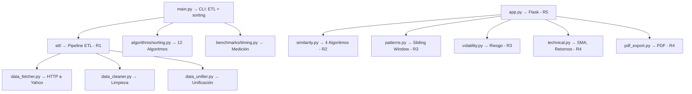

# Guía de Flujo del Proyecto — Cumplimiento de Requerimientos

> [!IMPORTANT]
> **Para usar esta guía:** Abre en VS Code y presiona `Ctrl + Shift + V`. Haz clic en los enlaces para ir al código.
> Numeración alineada con: **"Proyecto Análisis de Algoritmos - 2026-1.pdf"**

---

## Arquitectura General



---

## Restricciones del PDF — Cómo se cumplen

| Restricción del PDF | Cómo se cumple | Archivo |
|---|---|---|
| Sin yfinance/pandas_datareader | `urllib.request` + JSON manual | [data_fetcher.py](etl/data_fetcher.py) |
| Sin pandas | `csv` estándar + `list`/`dict` | Todo el proyecto |
| Sin funciones de similitud | 4 algoritmos desde cero con `math` | [similarity.py](algorithms/similarity.py) |
| Reproducibilidad total | `python main.py` regenera todo | [main.py](main.py) |

---

## R1 — ETL: Extracción, Limpieza y Unificación

### Punto de entrada
`python main.py` → [main.py L316](main.py#L316) llama `run_etl()` → [etl_pipeline.py L82](etl/etl_pipeline.py#L82)

### Fases del ETL

| Fase | Dónde se llama | Implementación |
|---|---|---|
| **Extracción** (20 activos, HTTP) | [etl_pipeline.py L136](etl/etl_pipeline.py#L136) | [data_fetcher.py L286](etl/data_fetcher.py#L286) |
| **Detección faltantes** | [etl_pipeline.py L198](etl/etl_pipeline.py#L198) | [data_cleaner.py L27](etl/data_cleaner.py#L27) |
| **Detección anomalías** | [etl_pipeline.py L214](etl/etl_pipeline.py#L214) | [data_cleaner.py L88](etl/data_cleaner.py#L88) |
| **Corrección (Forward Fill)** | [etl_pipeline.py L233](etl/etl_pipeline.py#L233) | [data_cleaner.py L150](etl/data_cleaner.py#L150) |
| **Eliminación filas inválidas** | [etl_pipeline.py L240](etl/etl_pipeline.py#L240) | [data_cleaner.py L194](etl/data_cleaner.py#L194) |
| **Calendario maestro** | [etl_pipeline.py L255](etl/etl_pipeline.py#L255) | [data_unifier.py L14](etl/data_unifier.py#L14) |
| **Alinear activos** | [etl_pipeline.py L258](etl/etl_pipeline.py#L258) | [data_unifier.py L73](etl/data_unifier.py#L73) |
| **Dataset maestro** | [etl_pipeline.py L261](etl/etl_pipeline.py#L261) | [data_unifier.py L157](etl/data_unifier.py#L157) |

### Extras (Ordenamiento y Benchmarks)
- 12 algoritmos de ordenamiento: [sorting.py](algorithms/sorting.py)
- Benchmark + diagrama de barras: [main.py L350](main.py#L350), [main.py L372](main.py#L372) → [timing.py L179](benchmarks/timing.py#L179)
- Top 15 por volumen: [main.py L353](main.py#L353) → [main.py L216](main.py#L216)

---

## R2 — Algoritmos de Similitud (Análisis Comparativo)

### Punto de entrada
Página `/similarity` → API: [app.py L166](app.py#L166) (`/api/similarity`) → [app.py L167](app.py#L167) (`api_similarity()`)

### Los 4 algoritmos

| Algoritmo | Implementación | Complejidad |
|---|---|---|
| Distancia Euclidiana | [similarity.py L36](algorithms/similarity.py#L36) | O(n), O(1) espacio |
| Correlación de Pearson | [similarity.py L100](algorithms/similarity.py#L100) | O(n), 2 pasadas |
| Dynamic Time Warping (DTW) | [similarity.py L200](algorithms/similarity.py#L200) | O(n·w), banda Sakoe-Chiba |
| Similitud por Coseno | [similarity.py L359](algorithms/similarity.py#L359) | O(n), O(1) espacio |

### Flujo completo

```
Usuario selecciona 2 activos en /similarity
  → JS llama fetch('/api/similarity?a=VOO&b=SPY')
    → api_similarity() en app.py L167
      → compare_two_assets() en similarity.py L440
        1. Alinear precios válidos
        2. Calcular retornos logarítmicos (compute_returns)
        3. Ejecutar los 4 algoritmos sobre retornos
      → Retorna JSON con métricas + datos para gráficos
    → similarity.js dibuja Canvas por algoritmo
```

### Funciones de soporte
- Comparación consolidada: [similarity.py L440](algorithms/similarity.py#L440) (`compare_two_assets`)
- DTW con warping path (para gráficos): [similarity.py L536](algorithms/similarity.py#L536)
- Retornos logarítmicos: [technical.py L104](algorithms/technical.py#L104)

### Visualización
- [similarity.js](static/js/similarity.js) — cada algoritmo con gráfico Canvas propio

---

## R3 — Patrones (Sliding Window) + Volatilidad/Riesgo

### R3 Parte 1 — Patrones con Sliding Window

Punto de entrada: [app.py L409](app.py#L409) (`/api/patterns/<symbol>`) → [patterns.py L271](algorithms/patterns.py#L271) (`scan_patterns`)

| Patrón | Implementación | Complejidad |
|---|---|---|
| **Días consecutivos al alza** (requerido) | [patterns.py L28](algorithms/patterns.py#L28) | O(n·w) |
| **Gap-up** (patrón adicional formalizado) | [patterns.py L155](algorithms/patterns.py#L155) | O(n) |

### R3 Parte 2 — Volatilidad y Clasificación de Riesgo

Punto de entrada: [app.py L447](app.py#L447) (`/api/risk`) → [volatility.py L226](algorithms/volatility.py#L226) (`analyze_portfolio_risk`)

| Función | Implementación | Qué hace |
|---|---|---|
| Volatilidad histórica | [volatility.py L63](algorithms/volatility.py#L63) | σ_anual = σ_diaria × √252 |
| Clasificación de riesgo | [volatility.py L128](algorithms/volatility.py#L128) | Insertion sort + percentiles P33/P66 |

---

## R4 — Dashboard Visual + Exportación PDF

### R4.1 — Mapa de calor (Heatmap de correlación)
- Ruta: [app.py L322](app.py#L322) (`/api/heatmap`)
- Calcula `pearson_correlation()` para cada par de activos

### R4.2 — Candlestick con SMA
- Ruta: [app.py L360](app.py#L360) (`/api/candlestick/<symbol>`)
- SMA algorítmica: [technical.py L193](algorithms/technical.py#L193) (`compute_sma`)

### R4.3 — Exportación PDF
- Ruta: [app.py L489](app.py#L489) (`/export/pdf`) → [pdf_export.py L84](visualization/pdf_export.py#L84)

### Gráficos (Canvas API — sin Chart.js ni Plotly)
- [dashboard.js](static/js/dashboard.js) — candlestick, heatmap, barras de riesgo
- [similarity.js](static/js/similarity.js) — 4 visualizaciones por algoritmo

---

## R5 — Despliegue Web Funcional

Servidor Flask: `python app.py` → [app.py L506](app.py#L506)

| Ruta | Template | Requerimiento |
|---|---|---|
| `/` | [dashboard.html](templates/dashboard.html) | R4 (candlestick, heatmap) |
| `/similarity` | [similarity.html](templates/similarity.html) | R2 (4 algoritmos) |
| `/patterns` | [patterns.html](templates/patterns.html) | R3 (sliding window) |
| `/risk` | [risk.html](templates/risk.html) | R3 (volatilidad) |
| `/export/pdf` | — | R4 (reporte PDF) |

---

## Mapa Final de Cumplimiento

| Req | Descripción oficial (PDF) | Archivos clave | Entrada |
|---|---|---|---|
| **R1** | ETL automatizado (≥5 años, ≥20 activos, limpieza) | `etl/` (4 archivos) | [main.py L316](main.py#L316) |
| **R2** | 4 algoritmos de similitud + visualización | `similarity.py`, `similarity.js` | [app.py L166](app.py#L166) |
| **R3** | Sliding window + volatilidad/riesgo | `patterns.py`, `volatility.py` | [app.py L409](app.py#L409), [app.py L447](app.py#L447) |
| **R4** | Heatmap + Candlestick + SMA + PDF | `app.py`, `dashboard.js`, `pdf_export.py` | [app.py L322](app.py#L322), [app.py L360](app.py#L360) |
| **R5** | Despliegue web funcional + documentación | `app.py`, `templates/` | [app.py L506](app.py#L506) |

---

## Flujo de Demostración

```bash
# 1. ETL completo (R1) + sorting extras
python main.py

# 2. Servidor web (R2 + R3 + R4 + R5)
python app.py

# 3. Navegador:
#   localhost:5000             → R4 (candlestick, heatmap, SMA)
#   localhost:5000/similarity  → R2 (4 algoritmos de similitud)
#   localhost:5000/patterns    → R3 (sliding window)
#   localhost:5000/risk        → R3 (volatilidad, clasificación)
#   localhost:5000/export/pdf  → R4 (reporte PDF)
```
